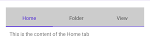
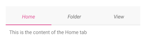
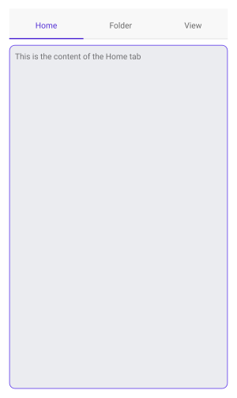

# .NET MAUI TabView Styling

The .NET MAUI TabView provides means for modifying its visual appearance so that it matches the style of the app.  You can style different parts of the TabView—its header, items, and content area. 

> Check the [TabView Visual Structure]() topic for a visual representation of the TabView elements.

## TabView Styling

You can use any of the following TabView properties to change its look&amp;feel:

* `BackgroundColor` (`Color`)&mdash;Specifies the background color of the control.
* `BorderColor` (`Color`)&mdash;Specifies the border color of the control.
* `BorderThickness` (`Thickness`)&mdash;Specifies the border thickness of the control.
* `CornerRadius` (`Thickness`)&mdash;Specifies the corner radius of the control.
* `ContentPadding` (`Thickness`)&mdash;Specifies the padding of the inner content of the control.

In addition, TabView provides the listed below styling properties for modifying its elements - header, TabView items and content area.

* `HeaderStyle`&mdash;Specifies the style of the entire header area (border, background color etc.);
* `HeaderItemStyle`&mdash;Specifies the style of the individual header items (font, text color etc.)
* `ContentStyle`&mdash;Specifies the style of the entire content area (borders, background color etc.);

## Header Styling

Through `HeaderStyle` property of the TabView you can modify the `TabViewHeader`. The properties `TabViewHeader` provides are described in the table below:

| Property | Description |
| -------- | ---------- |
| `BackgroundColor` (`Color`) | Specifies the background color of the header area. |
| `BorderColor` (`Color`) | Specifies the border color of the header area. |
| `BorderThickness` (`Thickness`) | Specifies the border thickness of the header area. |
| `CornerRadius` (`Thickness`) | Specifies the corner radius of the header area. |
| `ContentPadding` (`Thickness`) | Specifies the padding of the inner content of the header area. |
| `Spacing` (`double`) | Specifies the spacing in pixels between the header items in the header area. |
| `SelectedIndex` (`int`) | Specifies the index of the currently selected item in the header area. |
| `IsScrollable` (`bool`) | Specifies whether the header area can be scrolled with pan gesture. |
| `Orientation` (`enum` of type `Telerik.Maui.Controls.TabViewScrollOrientation`) | Specifies the scroll orientation of the header area. The available options are `Horizontal` and `Vertical`. |

Check below a quick example:

<snippet id='tabview-styling-headerstyle' />

And the result is the following:

> For a runnable example with the TabView HeaderStyle scenario, see the [SDKBrowser Demo Application]() and go to **TabView > Styling**.

## HeaderItem Styling

Through `HeaderItemStyle` property of the TabView the following styling properties can be applied to the `TabViewHeaderItem`:

| Property | Description |
| -------- | ---------- |
| `BackgroundColor` | Specifies the background color of the header item. |
| `BorderColor` | Specifies the border color of the header item. |
| `BorderThickness` | Specifies the border thickness of the header item. |
| `CornerRadius` | Specifies the corner radius of the header item. |
| `ContentPadding` | Specifies the padding of the inner content of the header item. |
| `TextColor` | ;Specifies the color of the text in the header item. |
| `FontFamily` | Specifies the font family of the text in the header item. |
| `FontSize` | Specifies the font size of the text in the header item. |
| `FontAttributes` | Specifies the font attributes of the text in the header item. |
| `TextDecorations` | Specifies the decorations of the text in the header item. |
| `HorizontalTextAlignment` | Specifies the horizontal alignment of the text in the header item. |
| `VerticalTextAlignment` | Specifies the vertical alignment of the text in the header item. |
| `ImageSource` | Specifies the source of the image icon in the header item. |
| `ImageAspect` | Specifies the aspect of the image icon in the header item. |
| `ImageWidth` | Specifies the width of the image icon in the header item. |
| `ImageHeight` | Specifies the height of the image icon in the header item. |
| `ImageSpacing` | Specifies the spacing between the image icon and the text in the header item. |
| `ImagePosition` | Specifies the position of the image icon relative to the text (`Left`, `Top`, `Right`, and `Bottom`). |

<snippet id='tabview-styling-headeritemstyle' />

Here is the TabView after applying the `HeaderItemStyle`:

> For a runnable example with the TabView HeaderItemStyle scenario, see the [SDKBrowser Demo Application]() and go to **TabView > Styling**.

## Content Styling

TabView's `ContentStyle` property allows you to style the content area. `TabViewContent` provides the following properties:

* `BackgroundColor` (`Color`)&mdash;Specifies the background color of the content.
* `BorderColor` (`Color`)&mdash;Specifies the border color of the content.
* `BorderThickness` (`Thickness`)&mdash;Specifies the border thickness of the content.
* `CornerRadius` (`Thickness`)&mdash;Specifies the corner radius of the content.
* `ContentPadding` (`Thickness`)&mdash;Specifies the padding of the inner content of the content.

<snippet id='tabview-styling-contentstyle' />

The image below shows TabView after applying `ContentStyle`:

> For a runnable example with the TabView ContentStyle scenario, see the [SDKBrowser Demo Application]() and go to **TabView > Styling**.

## See Also

- [TabViewItem]()
- [Selection]()
- [Templates]()