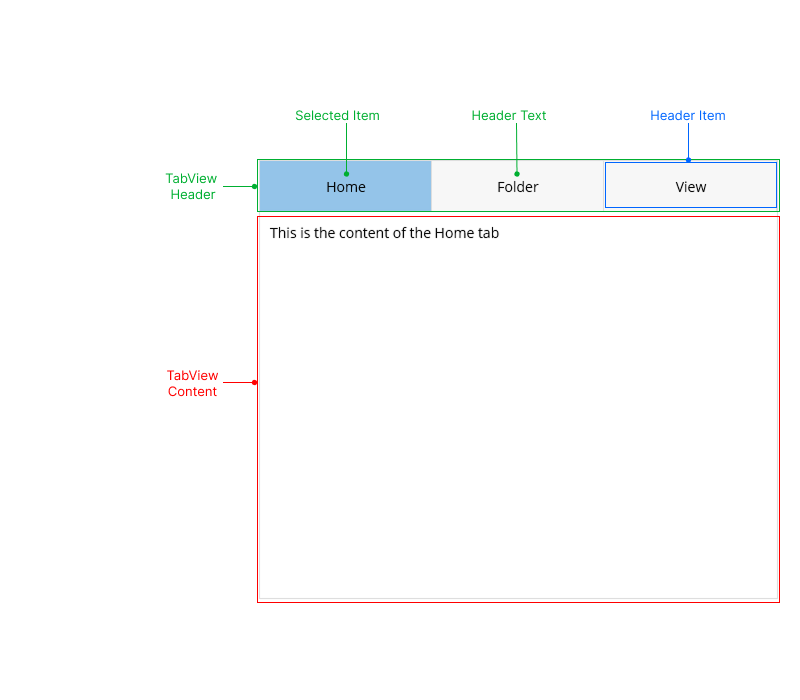

# .NET MAUI TabView Templates

The TabView provides set of templates for its elements. If you want to change the TabView appearance you can use the provided templates: 

* `HeaderTemplate` (`ControlTemplate`)&mdash;Defines the template of the entire header area. This includes the tabs in the Header (Header area + Header items).
* `HeaderItemTemplate` (`ControlTemplate`)&mdash;Defines the template of the individual header items.
* `ContentTemplate` (`ControlTemplate`)&mdash;Defined the template of the entire content area.

>note If you do not want to change the default templates you can customize the look of the TabView, TabView Header, TabView `HeaderItem` and TabView Content using the flexible styling API. For more details review the [TabView Styling article]().

## See Also

- [TabViewItem]()
- [Selection]()
- [Styling]()
