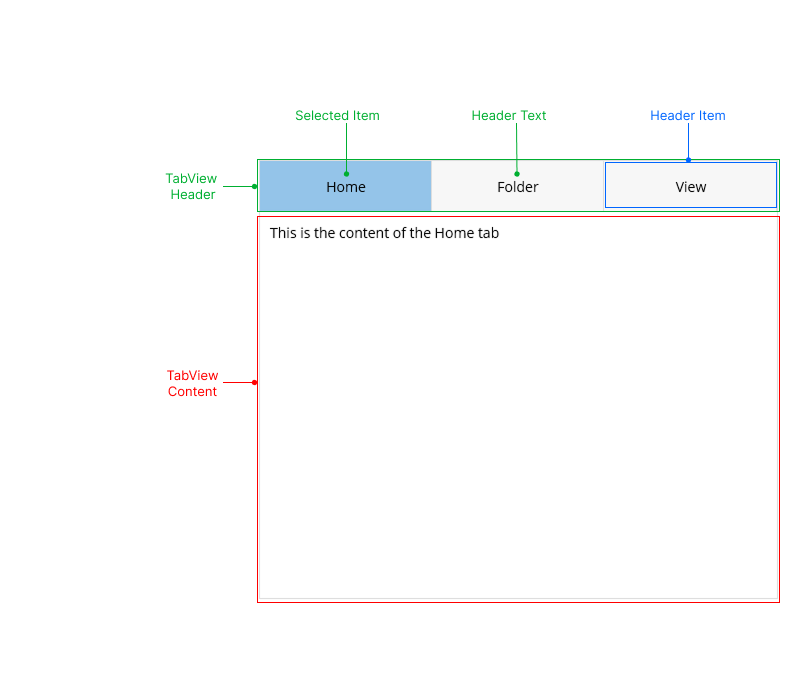

# .NET MAUI TabView Visual Structure

The TabView uses a set of visual elements when rendered.

## Displayed Elements

- **Header area**&mdash;The area with the TabView header. The Header holds all TabView header items.
- **Header items**&mdash;The TabView header items.
- **Content area**&mdash;The content area corresponding to each header item.

## See Also

- [Configuration]()
- [TabViewItem]()
- [Selection]()
- [Styling]()
- [Templates]()
