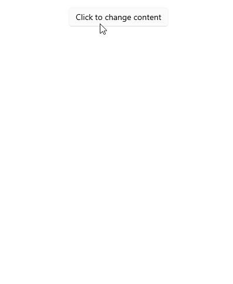

# .NET MAUI TemplatedButton Command

The Telerik .NET MAUI TemplatedButton allows you to attach a command that executes when the button is clicked or tapped.

* `Command` (`ICommand`)&mdash;Defines the command which executes when the button is clicked or tapped.
* `CommandParameter` (`object`)&mdash;Specifies the parameter of the command which executes when the button is clicked or tapped.

## Using the Command

The following example demonstrates how to use the `Command` to change the text displayed within the ToggledButton on click.

**1.** Define the TemplatedButton in XAML:

<snippet id='templatedbutton-command-xaml' />

**2.** Add the `telerik` namespace:

```XAML
xmlns:telerik="http://schemas.telerik.com/2022/xaml/maui"
```

**3.** Add the `ViewModel`:

<snippet id='templatedbutton-command-viewmodel' />

This is the result on WinUI:



> For a runnable example demonstrating the TemplatedButton Command, see the [SDKBrowser Demo Application]() and go to the **TemplatedButton > Features** category.

## See Also

- [Configure the TemplatedButton]()
- [Loading Button]()
- [Set Visual States]()
- [Events]()
- [Style the TemplatedButton]()