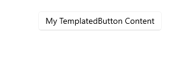
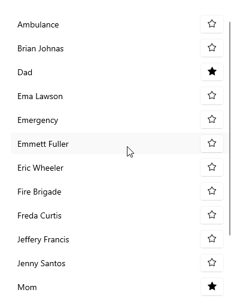

# .NET MAUI TemplatedButton Content Configuration

The purpose of this help article is to show you the main configuration options of the control.

## Setting Content

Define the content inside the TemplatedButton by setting the `Content` property (`object`) or `ContentTemplate` (`DataTemplate`) property.

The `Content` is responsible for the actual content displayed in the button. It can be set to `string`, `View`, object, etc.

Here are the scenarios for the visualization of `Content` or `ContentTemplate` inside the `RadTemplatedButton`:

* If `ContentTemplate` is set, the `View` returned from the `ContentTemplate`.`CreateView()` is displayed inside the `RadTemplatedButton.ControlTemplate`, having `Content` as its `BindingContext`.

* If `ContentTemplate` is `DataTemplateSelector`, first the `DataTemplate` is selected and then a `View` is created from the chosen template using `Content` as its `BindingContext`.

* If `Content` is set to a `View` and `ContentTemplate` isn't set, the `View` is displayed inside the `RadTemplatedButton.ControlTemplate`.
If `Content` is set to a `string` and `ContentTemplate` isn't set, a `Label` is displayed inside the `RadTemplatedButton.ControlTemplate`.

* If `Content` is set to an `object` and `ContentTemplate` isn't set, the `ToString()` of the `object` is used and converted to `Label` inside the `RadTemplatedButton.ControlTemplate`.

__Setting Content to String__

<snippet id='templatedbutton-gettingstarted-xaml' />

__Setting ContentTemplate__

<snippet id='templatedbutton-content-template' />

## Text Alignment

Use the following properties to align the text in the button when `Content` is `string` and `ContentTemplate` is not set.

* `HorizontalTextAlignment` (`Microsoft.Maui.TextAlignment`)&mdash;Specifies the horizontal alignment of the `Label.Text`. 
* `VerticalTextAlignment` (`Microsoft.Maui.TextAlignment`)&mdash;Specifies the vertical alignment of the `Label.Text`.

## Text Decoration

Use the `TextDecorations` (enum of type `Microsoft.Maui.TextDecorations`) property to specify the text decorations of the `Label` created when `Content` is `string` and `ContentTemplate` is not set.

## Font Options

The following properties specify the font options that apply to the content when `Content` is `string` and `ContentTemplate` is not set.

* `FontFamily` (`string`)&mdash;Specifies the font family of the `Label.Text`.
* `FontSize` (`double`)&mdash;Specifies the font size in pixels of the `Label.Text`.
* `FontAttributes` (`Microsoft.Maui.Controls.FontAttributes`)&mdash;Specifies the font attributes of the `Label.Text`.

## See Also

- [Loading Button]()
- [Set Visual States]()
- [Events]()
- [Execute Command]()
- [Style the TemplatedButton]()