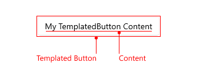

# How to Create a Loading Button

You can create a loading button using the Telerik .NET MAUI TemplatedButton. The loading indicator displays inside the button when users click or tap the button. 

The following `.gif` shows the loading button:



## Solution

To create a loading button, use a `RadTemplatedButton` with a `ContentTemplate`. Then inside the `ContentTemplate` define a `RadBusyIndicator`.

**1.** Define the button in XAML:

<snippet id='templatedbutton-loadingbutton' />

**2.** Add the `telerik` namespace:

```XAML
xmlns:telerik="http://schemas.telerik.com/2022/xaml/maui"
```

**3.** Define the `ViewModel`:

<snippet id='loadingbutton-viewmodel' />

This is the result on WinUI:


## Additional Resources

- [Configure the TemplatedButton]()
- [Set Visual States]()
- [Events]()
- [Execute Command]()
- [Style the TemplatedButton]()

## See Also

- [.NET MAUI TemplatedButton Product Page](https://www.telerik.com/maui-ui/templatedbutton)
- [.NET MAUI TemplatedButton Forum Page](https://www.telerik.com/forums/maui?tagId=2057)
- [Telerik .NET MAUI Blogs](https://www.telerik.com/blogs/mobile-net-maui)
- [Telerik .NET MAUI Roadmap](https://www.telerik.com/support/whats-new/maui-ui/roadmap)