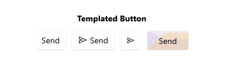

# .NET MAUI TemplatedButton Overview

The Telerik UI for .NET MAUI TemplatedButton represents a button with customizable content. You can set the content to a `string`, `View`, use the `ContentTemplate` or retemplate the control.
Additionally, it enables you to align its content and define custom content by using a template, applying visual states and more. 

## Key Features of the .NET MAUI TemplatedButton

* [Content and ContentTemplate](#setting-content)&mdash;The TemplatedButton allows you to define a `Content`. In addition, there is an option for setting `ContentTemplate`. For example you can implement a [Loading Button]() using the `ContentTemplate`.
* [Text alignment](#text-alignment)&mdash;The TemplatedButton enables you to control the horizontal and vertical positioning of the text inside the content.
* [Visual states]()&mdash;You can change the TemplatedButton appearance for different visual states like, `Normal`, `Pressed`, `PointerOver` (desktop-only), and `Disabled`.
* [Exhaustive number of events]()&mdash;You can use the events exposed by the TemplatedButton to execute various operations on user interactions such as click, press, and release.
* [Command]()&mdash;The TemplatedButton provides a command, that executes when the button is clicked.
* [Styling]()&mdash;You can apply different styling options to the button such as changing its background color, border color, border thickness, and more.

## Next Steps

- [Getting Started with Telerik UI for .NET MAUI TemplatedButton]()

## See Also

- <a href="https://www.telerik.com/maui-ui/templatedbutton" target="_blank">.NET MAUI TemplatedButton Product Page</a>
- <a href="https://www.telerik.com/forums/maui?tagId=2057" target="_blank">.NET MAUI TemplatedButton Forum Page</a>
- <a href="https://www.telerik.com/blogs/mobile-net-maui" target="_blank">Telerik .NET MAUI Blogs</a>
- <a href="https://www.telerik.com/support/whats-new/maui-ui/roadmap" target="_blank">Telerik .NET MAUI Roadmap</a>