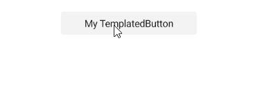
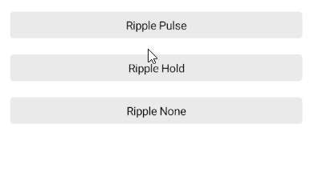

# (Android-only) .NET MAUI TemplatedButton Ripple Effect

Apply a ripple effect to the TemplatedButton, by using the following attached properties of the `RadEffects` class:

* `RippleColor` (`Color`)&mdash;Specifies the color of the ripple effect.
* `RippleMode` (enum of type `Telerik.Maui.Theming.RippleMode`)&mdash;Specifies the mode in which the ripple effect can be visualized. The options are:
	* (Default)`Pulse`&mdash;The element produces a ripple effect when pressed. The ripple fades away even when held.
	* `Hold`&mdash;The element produces a ripple effect when pressed and floods the element while held.
	* `None`&mdash;The element does not render ripple effects.


> The ripple effect is available on Android.



### Customizing the Ripple Effect

The following example demonstrates how to customize the ripple effect of the TemplatedButton by changing the `RippleMode` and `RippleColor`.

**1.** Define the buttons in XAML:

<snippet id='templatedbutton-ripple-effect' />

**2.** Add the `telerik` namespace:

```XAML
xmlns:telerik="http://schemas.telerik.com/2022/xaml/maui"
```

This is the result on Android:



> For a runnable example demonstrating the TemplatedButton ripple effect, see the [SDKBrowser Demo Application]() and go to the **TemplatedButton > Features** category.

## See Also

- [Configure the TemplatedButton]()
- [Loading Button]()
- [Set Visual States]()
- [Events]()
- [Execute Command]()
- [Style the TemplatedButton]()
