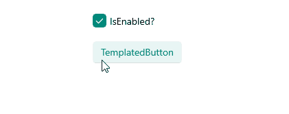

# .NET MAUI TemplatedButton Visual States

The TemplatedButton provides the following `CommonStates` visual states:

| Visual States | Description |
| ------------- | --------------- |
| `Normal` | Applies when the button is in normal state. |
| `Pressed` | Applies when the button is pressed. |
| `PointerOver` | (Desktop-only) Applies when the mouse pointer hovers over the control. |
| `Disabled` | Applies when the button is disabled. |

## Using the Visual States

The following example demonstrates how to use the TemplatedButton visual states.

**1.** Define the TemplatedButton in XAML:

<snippet id='templatedbutton-visual-states' />

**2.** Define the visual states in the page's resources:

<snippet id='templatedbutton-visual-states-resources' />

**3.** Add the `telerik` namespace:

```XAML
xmlns:telerik="http://schemas.telerik.com/2022/xaml/maui"
```

This is the result on WinUI:



> For a runnable example demonstrating the TemplatedButton visual states, see the [SDKBrowser Demo Application]() and go to the **TemplatedButton > Features** category.

## See Also

- [Configure the TemplatedButton]()
- [Loading Button]()
- [Events]()
- [Execute Command]()
- [Style the TemplatedButton]()