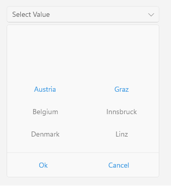

# .NET MAUI TemplatedPicker Data Binding

The TemplatedPicker for .NET MAUI provides means for creating a fully-customizable picker control. You can place any list of items inside the popup for the user to choose from and show the selected value in a defined format.

This article describes the TemplatedPicker properties that are used for binding and presenting the selected value, which comes from the selector data source. The selector can be any control shows a list of items user can choose from, for example, `CollectionView`, `RadSpinner`, and so on.

* `DisplayMemberPath`&mdash;Specifies a property of the source object to serve as the visual representation of the selected item.

* `DisplayStringFormat`&mdash;Enables you to choose what text to display when an item from the selector was picked through the `DisplayStringFormat` TemplatedPicker property.

* `SelectedValue`&mdash;Used when you have linked your TemplatedPicker to a data source, and you want to return a value of type object different from the one which is displayed.

## Clear Button

You can enable a Clear button which can be used to quickly remove the selected value. To enable the button, set ``IsClearButtonVisible`` property of the TemplatedPicker:

```XAML
<telerik:RadTemplatedPicker IsClearButtonVisible="True" />

## Example

The example below uses two `RadSpinner` controls inside the `SelectorTemplate` of the TemplatedPicker which present cascading lists of items (the items shown in the second spinner depend on the selected value from the first spinner). Through the `SelectedValue` and `DisplayMemberPath` properties you can define how the selection from the spinners is visualized in the picker when the popup is closed.

1. Define the control.

 <snippet id='templatedpicker-keyfeatures' />

1. Define the `SelectorTemplate`:

 <snippet id='templatedpicker-keyfeatures-selectortemplate' />

1. Define the `HeaderTemplate`:

 <snippet id='templatedpicker-keyfeatures-headertemplate' />

1. Add the following data item for the first spinner:

 <snippet id='templatedpicker-country-businessmodel' />

1. Add the following data item for the second spinner:

 <snippet id='templatedpicker-city-businessmodel' />

1. Define the `ViewModel`:

 <snippet id='templatedpicker-viewmodel' />

1. Set the defined `LocationViewModel` as a `BindingContext` of the page:

 ```C#
this.BindingContext = new LocationViewModel();
 ```

1. In addition to this, you need to add the following namespace:

 ```XAML
xmlns:telerik="http://schemas.telerik.com/2022/xaml/maui"
 ```


The following image shows the end result.



## See Also

- [Templates]()
- [Styling]()
