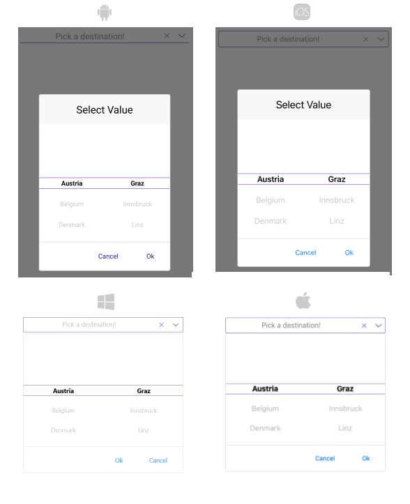

# .NET MAUI TemplatedPicker Styling

The TemplatedPicker control for .NET MAUI provides styling options for customizing its appearance.  You can style the TemplatedPicker itself, as well as its popup or dropdown depending on the [PickerMode]() setting.

The control supports the following styling properties:

* `BackgroundColor`&mdash;Defines the background color of the picker.
* `BorderColor`&mdash;Defines the border color of the picker.
* `BorderThickness`&mdash;Specifies the border thickness of the picker. The default value is `new Thickness(0,0,0,1)`.
* `CornerRadius`&mdash;Specifies the corner radius of the picker.
* `ClearButtonStyle`(of type `Style` with target type `RadButton`)&mdash;Defines the style applied to the Clear button.
* `ToggleButtonStyle`(of type `Style` with target type `RadButton`)&mdash;Specifies the style of the [Toggle button](#toggle-button).
* `PlaceholderLabelStyle` (of type `Style` with target type `Label`)&mdash;Defines the style applied to the placeholder label.
* `DisplayLabelStyle` (of type `Style` with target type `Label`)&mdash;Defines the style applied to the label which is visualized when an item from the selector is picked.

The TemplatedPicker exposes the following properties for styling its border and background color:

## Example

The following example shows how the styling properties are applied.

**Define the `RadTemplatedPicker`**

<snippet id='templatedpicker-style' />

**Define the PlaceholderLabelStyle**

<snippet id='templatedpicker-placeholderlabelstyle' />

**Define the DisplayLabelStyle**

<snippet id='templatedpicker-displaylabelstyle' />

**Add the following data item for the first spinner**

<snippet id='templatedpicker-country-businessmodel' />

**Add the following data item for the second spinner**

<snippet id='templatedpicker-city-businessmodel' />

**Here is a sample definition of the `ViewModel`**

<snippet id='templatedpicker-viewmodel' />

**Set the defined `LocationViewModel` as a `BindingContext` of the page**

```C#
this.BindingContext = new LocationViewModel();
```

This is how the TemplatedPicker looks when the styling properties are applied:



>important For a sample Styling example, refer to the `TemplatedPicker/Styling` folder of the [Telerik UI for .NET MAUI SDKBrowser Application]().

## See Also

- [Popup styling]()
- [Dropdown Styling]()
- [Templates]()
