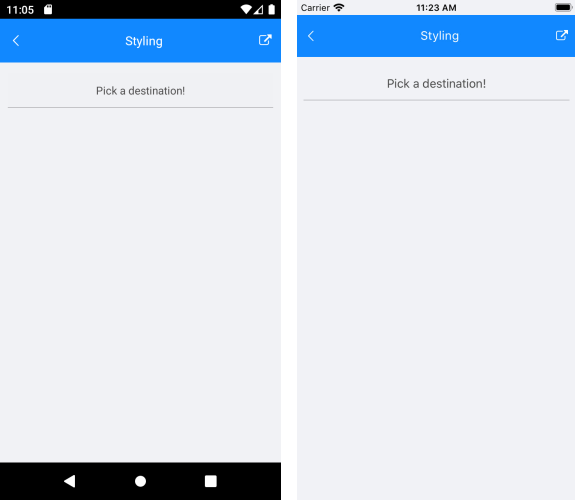
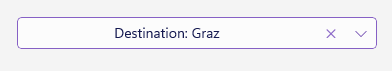

# Styling

## TemplatedPicker Styling

* `PlaceholderLabelStyle`(of type *Style* with target type **Label**): Defines the style applied to the placeholder label.

* `DisplayLabelStyle`(of type *Style* with target type **Label**): Defines the style applied to the label which is visualized when item from the selector is picked.

TemplatedPicker exposes the following properties for styling its Border and Background Color:

* `BackgroundColor`: Defines the background color of the picker.

* `BorderColor`: Defines the border color of the picker.

* `BorderThickness`: Specifies the border thickness of the picker. Default value is `new Thickness(0,0,0,1)`.

* `CornerRadius`: Specifies the corner radius of the picker.

### PlaceholderLabel Style


```XAML
<Style x:Key="DefaultPlaceholderLabelStyle" TargetType="Label">
	<Setter Property="TextColor" Value="#4A4949"/>
	<Setter Property="HorizontalTextAlignment" Value="Center"/>
	<Setter Property="VerticalTextAlignment" Value="Center"/>
</Style>
```

### DisplayLabel Style


```XAML
<Style x:Key="DisplayLabelStyle" TargetType="Label">
	<Setter Property="TextColor" Value="#4A4949"/>
	<Setter Property="HorizontalTextAlignment" Value="Center"/>
	<Setter Property="VerticalTextAlignment" Value="Center"/>
</Style>
```

## Popup Styling

Using the `SelectorSettings` property of the TemplatedPicker you can modify the appearance of the dialog (popup). `PickerPopupSelectorSettings` class exposes the following Style properties:

* `PopupViewStyle`(of type *Style* with target type **telerikInput:PickerPopupContentView**): Defines the popup view style.

* `HeaderStyle`(of type *Style* with target type **telerikInput:PickerPopupHeaderView**): Defines the popup header style.

* `HeaderLabelStyle`(of type *Style* with target type **Label**): Defines the popup header label style.

* `FooterStyle`(of type *Style* with target type **telerikInput:PickerPopupFooterView**): Defines the popup footer style.

* `AcceptButtonStyle`(of type *Style* with target type **Button**): Defines the Accept button style.

* `CancelButtonStyle`(of type *Style* with target type **Button**): Defines the Cancel button style.

`SelectorSettings` also provides the following properties for popup customization:

* `PopupOutsideBackgroundColor`: Defines the color outside of the popup.

* `IsPopupModal`(*bool*): Defines a boolean value indicating if the popup should be closed when tapped outside of the popup. By default the value of the `IsPopupModal` is **false**.
	* When *IsPopupModal="True"*  the UI behind the popup gets inactive and cannot be used until the popup is closed. 
	* When *IsPopupModal="False"* the popup could be closed when clicking outside the popup. 
	
* `HeaderLabelText`(*string*): Specifies the text visualized in the popup header.

* `IsHeaderVisible`(*bool*): Specifies whether the Popup header is currently visible. By default the valuse is *True*.

* `IsFooterVisible`(*bool*): Specifies whether the Popup footer is currently visible. By default the valuse is *True*.

* `AcceptButtonText`(*string*): Defines the text visualized for the accept button. By default the text is *OK*.

* `CancelButtonText`(*string*): Defines the text visualized for the cancel button. By default the text is *Cancel*. 

## Namespaces

Using one of the following styles **PopupViewStyle**, **HeaderStyle**, **FooterStyle** you need to add the following namespace

```XAML
xmlns:telerikInput="clr-namespace:Telerik.XamarinForms.Input;assembly=Telerik.Maui.Controls.Compatibility"
```

## Example

Here is a sample example which shows how the styling properties are applied.

A sample TemplatedPicker definition:

<snippet id='templatedpicker-style' />
```XAML
<telerikInput:RadTemplatedPicker Placeholder="Pick a destination!" 
								 DisplayStringFormat="Destination choosen: {0}"
								 DisplayLabelStyle="{StaticResource DisplayLabelStyle}"
								 PlaceholderLabelStyle="{StaticResource DefaultPlaceholderLabelStyle}"
								 Style="{StaticResource DefaultTemplatedPickerStyle}"
								 SelectedValue="{Binding FromCity, Mode=TwoWay}"
								 DisplayMemberPath="Name">
	<telerikInput:RadTemplatedPicker.SelectorSettings>
		<telerikInput:PickerPopupSelectorSettings>
			<telerikInput:PickerPopupSelectorSettings.HeaderTemplate>
				<ControlTemplate>
					<Grid BackgroundColor="{StaticResource AccentColor}">
						<Grid.ColumnDefinitions>
							<ColumnDefinition />
							<ColumnDefinition />
						</Grid.ColumnDefinitions>
						<Label Text="Origin Country"
							   Style="{StaticResource PickerHeaderLabelStyle}" />
						<Label Grid.Column="1"
							   Text="Origin City" 
							   Style="{StaticResource PickerHeaderLabelStyle}" />
					</Grid>
				</ControlTemplate>
			</telerikInput:PickerPopupSelectorSettings.HeaderTemplate>
			<telerikInput:PickerPopupSelectorSettings.HeaderStyle>
				<Style TargetType="telerikInput:PickerPopupHeaderView">
					<Setter Property="HeightRequest" Value="56" />
				</Style>
			</telerikInput:PickerPopupSelectorSettings.HeaderStyle>
			<telerikInput:PickerPopupSelectorSettings.AcceptButtonStyle>
				<Style TargetType="Button" 
					   BasedOn="{StaticResource PickerPopupFooterAcceptButton_Style}">
					<Setter Property="TextColor" Value="{StaticResource AccentColor}" />
				</Style>
			</telerikInput:PickerPopupSelectorSettings.AcceptButtonStyle>
			<telerikInput:PickerPopupSelectorSettings.CancelButtonStyle>
				<Style TargetType="Button" 
					   BasedOn="{StaticResource PickerPopupFooterCancelButton_Style}">
					<Setter Property="TextColor" Value="{StaticResource AccentColor}" />
				</Style>
			</telerikInput:PickerPopupSelectorSettings.CancelButtonStyle>
		</telerikInput:PickerPopupSelectorSettings>
	</telerikInput:RadTemplatedPicker.SelectorSettings>
	<telerikInput:RadTemplatedPicker.SelectorTemplate>
		<ControlTemplate>
			<Grid>
				<Grid.ColumnDefinitions>
					<ColumnDefinition />
					<ColumnDefinition />
				</Grid.ColumnDefinitions>
				<Grid.RowDefinitions>
					<RowDefinition Height="250" />
				</Grid.RowDefinitions>
				<telerik:RadBorder Grid.ColumnSpan="2"
								   Style="{StaticResource DefaultRadBorderStyle}" />
				<telerikDataControls:RadSpinner Grid.Column="0"
												ItemsSource="{Binding Countries}"
												SelectedItem="{Binding FromCountry, Mode=TwoWay}"
												ItemStyle="{StaticResource ItemStyle}"
												SelectedItemStyle="{StaticResource SelectedItemStyle}"
												DisplayMemberPath="Name" />
				<telerikDataControls:RadSpinner Grid.Column="1"
												ItemsSource="{Binding FromCountry.Cities}"
												SelectedItem="{TemplateBinding SelectedValue}"
												ItemStyle="{StaticResource ItemStyle}"
												SelectedItemStyle="{StaticResource SelectedItemStyle}"
												DisplayMemberPath="Name" />
			</Grid>
		</ControlTemplate>
	</telerikInput:RadTemplatedPicker.SelectorTemplate>
</telerikInput:RadTemplatedPicker>
```

and here are how the styles are defined in the page resources

## PlaceholderLabel Style

<snippet id='templatedpicker-placeholderlabelstyle' />
```XAML
<Style x:Key="DefaultPlaceholderLabelStyle" TargetType="Label">
	<Setter Property="TextColor" Value="#4A4949"/>
	<Setter Property="HorizontalTextAlignment" Value="Center"/>
	<Setter Property="VerticalTextAlignment" Value="Center"/>
</Style>
```

## DisplayLabel Style

<snippet id='templatedpicker-displaylabelstyle' />
```XAML
<Style x:Key="DisplayLabelStyle" TargetType="Label">
	<Setter Property="TextColor" Value="#4A4949"/>
	<Setter Property="HorizontalTextAlignment" Value="Center"/>
	<Setter Property="VerticalTextAlignment" Value="Center"/>
</Style>
```

## HeaderLabel Style

<snippet id='templatedpicker-headelabelstyle' />
```XAML
<Style x:Key="PickerHeaderLabelStyle"
	   TargetType="Label">
	<Setter Property="TextColor" Value="White" />
	<Setter Property="FontAttributes" Value="Bold" />
	<Setter Property="HorizontalOptions" Value="Center" />
	<Setter Property="VerticalOptions" Value="Center" />
</Style>
```

## Footer Style

<snippet id='templatedpicker-commonbuttonstyle' />
```XAML
<Style x:Key="PickerPopupFooterButtons_BaseStyle"
	   TargetType="Button">
	<Setter Property="BackgroundColor" Value="Transparent"/>
	<Setter Property="TextColor" Value="#007AFF"/>
	<Setter Property="VerticalOptions" Value="Center"/>
	<Setter Property="Margin">
		<OnPlatform x:TypeArguments="Thickness">
			<On Platform="iOS">0, 0, 20, 0</On>
		</OnPlatform>
	</Setter>
</Style>
```

## AcceptButton Style

<snippet id='templatedpicker-acceptbuttonstyle' />
```XAML
<Style x:Key="PickerPopupFooterAcceptButton_Style" BasedOn="{StaticResource PickerPopupFooterButtons_BaseStyle}"
	   TargetType="Button">
	<Setter Property="HorizontalOptions" Value="End"/>
</Style>
```

## CancelButton Style

<snippet id='templatedpicker-cancelbuttonstyle' />
```XAML
<Style x:Key="PickerPopupFooterCancelButton_Style" BasedOn="{StaticResource PickerPopupFooterButtons_BaseStyle}"
	   TargetType="Button">
	<Setter Property="HorizontalOptions" Value="EndAndExpand"/>
</Style>
```

add the following data item for the first spinner:

<snippet id='templatedpicker-country-businessmodel' />
```C#
public class Country : NotifyPropertyChangedBase
{
	private string name;

	public Country()
	{
		this.Cities = new ObservableCollection<City>();
	}

	public string Name
	{
		get
		{
			return this.name;
		}
		set
		{
			if (value != this.name)
			{
				this.UpdateValue(ref this.name, value);
			}
		}
	}

	public ObservableCollection<City> Cities { get; }
}
```

add the following data item for the second spinner:

<snippet id='templatedpicker-city-businessmodel' />
```C#
public class City : NotifyPropertyChangedBase
{
	private string name;

	public string Name
	{
		get
		{
			return this.name;
		}
		set
		{
			if (value != this.name)
			{
				this.UpdateValue(ref this.name, value);
			}
		}
	}
}
```

here is a sample definition of the ViewModel:

<snippet id='templatedpicker-viewmodel' />
```C#
public class LocationViewModel : NotifyPropertyChangedBase
{
	private Country fromCountry;
	private City fromCity;

	public LocationViewModel()
	{
		this.Countries = new ObservableCollection<Country>
		{
			new Country
			{
				Name = "Austria",
				Cities =
				{
					new City { Name = "Graz" },
					new City { Name = "Innsbruck" },
					new City { Name = "Linz" },
					new City { Name = "Ratz" },
					new City { Name = "Salzburg" },
					new City { Name = "Vienna" },
					new City { Name = "Wolfsberg" },
					new City { Name = "Zeltweg" }
				}
			},
			new Country
			{
				Name = "Belgium",
				Cities =
				{
					new City { Name = "Antwerp" },
					new City { Name = "Assesse" },
					new City { Name = "Bruges" },
					new City { Name = "Charleroi" },
					new City { Name = "Lint" },
					new City { Name = "Ranst" },
					new City { Name = "Schaffen" },
					new City { Name = "Veurne" },
					new City { Name = "Zingem" },
				}
			},
			new Country
			{
				Name = "Denmark",
				Cities =
				{
					new City { Name = "Aalborg" },
					new City { Name = "Aarhus" },
					new City { Name = "Billund" },
					new City { Name = "Copenhagen" },
					new City { Name = "Karup" },
					new City { Name = "Odense" },
					new City { Name = "Viborg" },
					new City { Name = "Vojens" }
				}
			},
			new Country
			{
				Name = "France",
				Cities =
				{
					new City { Name = "Aurillac" },
					new City { Name = "Belley" },
					new City { Name = "Bourg-en-Bresse" },
					new City { Name = "Carcassonne" },
					new City { Name = "Caen" },
					new City { Name = "Deauville" },
					new City { Name = "La Rochelle" },
					new City { Name = "Nice" },
					new City { Name = "Marseille" },
					new City { Name = "Paris - Val-De-Marne" },
					new City { Name = "Paris - Val d'Oise" },
					new City { Name = "Rodez" }
				}
			},
			new Country
			{
				Name = "Germany",
				Cities =
				{
					new City { Name = "Baden-Baden" },
					new City { Name = "Berlin" },
					new City { Name = "Borkum" },
					new City{ Name = "Bremen" },
					new City{ Name = "Dortmund" },
					new City{ Name = "Dresden" },
					new City{ Name = "Hamburg" },
					new City{ Name = "Hannover" },
					new City{ Name = "Leipzig" },
					new City{ Name = "Mannheim" },
					new City{ Name = "Munich" },
					new City{ Name = "Nuremberg" }
				}
			},
			new Country
			{
				Name = "Italy",
				Cities =
				{
					new City { Name = "Aosta" },
					new City { Name = "Bari" },
					new City { Name = "Bologna" },
					new City { Name = "Parma" },
					new City { Name = "Rimini" },
					new City { Name = "Rome - Fiumicino" },
					new City { Name = "Rome - Ciampino" }
				}
			},
			new Country
			{
				Name = "Netherlands",
				Cities =
				{
					new City { Name = "Amsterdam" },
					new City { Name = "Bonaire" },
					new City { Name = "Eindhoven" },
					new City { Name = "Maastricht" },
					new City { Name = "Rotterdam" }
				}
			},
			new Country
			{
				Name = "Portugal",
				Cities =
				{
					new City { Name = "Braga" },
					new City { Name = "Cascais" },
					new City { Name = "Lisbon" },
					new City { Name = "Porto" }
				}
			},
			new Country
			{
				Name = "Spain",
				Cities =
				{
					new City { Name = "Alicante" },
					new City { Name = "Barcelona" },
					new City { Name = "Madrid" },
					new City { Name = "Seville" },
					new City { Name = "Valencia" },
					new City { Name = "Zaragoza" }
				}
			},
			new Country
			{
				Name = "United Kingdom",
				Cities =
				{
					new City { Name = "Bristol Airport" },
					new City { Name = "Castle Donington" },
					new City { Name = "Liverpool" },
					new City { Name = "London City Airport" },
					new City { Name = "London Luton" },
					new City { Name = "Manchester Airport" },
					new City { Name = "Norwich" },
					new City { Name = "Southampton" }
				}
			},
		};
	}

	public Country FromCountry
	{
		get
		{
			return this.fromCountry;
		}
		set
		{
			if (value != this.fromCountry)
			{
				this.UpdateValue(ref this.fromCountry, value);
			}
		}
	}

	public City FromCity
	{
		get
		{
			return this.fromCity;
		}
		set
		{
			if (value != this.fromCity)
			{
				this.UpdateValue(ref this.fromCity, value);
			}
		}
	}

	public ObservableCollection<Country> Countries { get; }
}
```

Set thus defined LocationViewModel as a BindingContext of the page:

```C#
this.BindingContext = new LocationViewModel();
```

In addition to this, you need to add the following namespace:

```XAML
xmlns:telerikInput="clr-namespace:Telerik.XamarinForms.Input;assembly=Telerik.Maui.Controls.Compatibility"
```

This is how the TemplatedPicker looks when the styling properties are applied:


>important A sample Styling example can be found in the TemplatedPicker/Styling folder of the [Telerik UI for .NET MAUI SDKBrowser Application]().

## See Also

- [Getting Started]()
- [Templates]()