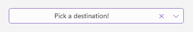

# Styling

The TemplatedPicker control for .NET MAUI provides styling options for customizing its appearance.

## TemplatedPicker Styling

* `PlaceholderLabelStyle` (of type `Style` with target type `Label`)&mdash;Defines the style applied to the placeholder label.

* `DisplayLabelStyle` (of type `Style` with target type `Label`)&mdash;Defines the style applied to the label which is visualized when an item from the selector is picked.

The TemplatedPicker exposes the following properties for styling its border and background color:

* `BackgroundColor`&mdash;Defines the background color of the picker.

* `BorderColor`&mdash;Defines the border color of the picker.

* `BorderThickness`&mdash;Specifies the border thickness of the picker. The default value is `new Thickness(0,0,0,1)`.

* `CornerRadius`&mdash;Specifies the corner radius of the picker.

### PlaceholderLabel Style



```XAML
<Style x:Key="DefaultPlaceholderLabelStyle" TargetType="Label">
	<Setter Property="TextColor" Value="#4A4949"/>
	<Setter Property="HorizontalTextAlignment" Value="Center"/>
	<Setter Property="VerticalTextAlignment" Value="Center"/>
</Style>
```

### DisplayLabel Style


```XAML
<Style x:Key="DisplayLabelStyle" TargetType="Label">
	<Setter Property="TextColor" Value="#4A4949"/>
	<Setter Property="HorizontalTextAlignment" Value="Center"/>
	<Setter Property="VerticalTextAlignment" Value="Center"/>
</Style>
```

## Popup Styling

By using the `SelectorSettings` property of the TemplatedPicker you can modify the appearance of the dialog (popup). The `PickerPopupSelectorSettings` class exposes the following `Style` properties:

* `PopupViewStyle`(of type `Style` with target type `telerikInput:PickerPopupContentView`)&mdash;Defines the popup view style.

* `HeaderStyle`(of type `Style` with target type `telerikInput:PickerPopupHeaderView`)&mdash;Defines the popup header style.

* `HeaderLabelStyle`(of type `Style` with target type `Label`)&mdash;Defines the popup header label style.

* `FooterStyle`(of type `Style` with target type `telerikInput:PickerPopupFooterView`)&mdash;Defines the popup footer style.

* `AcceptButtonStyle`(of type `Style` with target type `Button`)&mdash;Defines the **Accept** button style.

* `CancelButtonStyle`(of type `Style` with target type `Button`)&mdash;Defines the **Cancel** button style.

`SelectorSettings` also provides the following properties for popup customization:

* `PopupOutsideBackgroundColor`&mdash;Defines the color outside of the popup.

* `IsPopupModal`(`bool`)&mdash;Defines a boolean value indicating if the popup will be closed when the user clicks outside the popup. By default, the value of the `IsPopupModal` is `false`.
	* When `IsPopupModal="True"`, the UI behind the popup gets inactive and cannot be used until the popup is closed.
	* When `IsPopupModal="False"` the popup can be closed when the user clicks outside the popup.

* `HeaderLabelText`(`string`)&mdash;Specifies the text visualized in the popup header.

* `IsHeaderVisible`(`bool`)&mdash;Specifies whether the popup header is currently visible. By default, the value is `True`.

* `IsFooterVisible`(`bool`)&mdash;Specifies whether the popup footer is currently visible. By default, the value is `True`.

* `AcceptButtonText`(`string`)&mdash;Defines the text visualized for the **Accept** button. By default, the text is `OK`.

* `CancelButtonText`(`string`)&mdash;Defines the text visualized for the **Cancel** button. By default, the text is `Cancel`.

## Namespaces

When you use one of the `PopupViewStyle`, `HeaderStyle`, `FooterStyle` styles, you need to add the following namespace:

```XAML
xmlns:telerikInput="clr-namespace:Telerik.XamarinForms.Input;assembly=Telerik.Maui.Controls.Compatibility"
```

## Example

The following example shows how the styling properties are applied.

Define a sample TemplatedPicker:

<snippet id='templatedpicker-style' />

The following examples demonstrate how the styles are defined in the page resources.

## PlaceholderLabel Style

<snippet id='templatedpicker-placeholderlabelstyle' />

## DisplayLabel Style

<snippet id='templatedpicker-displaylabelstyle' />

## HeaderLabel Style

<snippet id='templatedpicker-headelabelstyle' />

## Footer Style

<snippet id='templatedpicker-commonbuttonstyle' />

## AcceptButton Style

<snippet id='templatedpicker-acceptbuttonstyle' />

## CancelButton Style

<snippet id='templatedpicker-cancelbuttonstyle' />

Add the following data item for the first spinner:

<snippet id='templatedpicker-country-businessmodel' />

Add the following data item for the second spinner:

<snippet id='templatedpicker-city-businessmodel' />

Here is a sample definition of the `ViewModel`:

<snippet id='templatedpicker-viewmodel' />

Set the defined `LocationViewModel` as a `BindingContext` of the page:

```C#
this.BindingContext = new LocationViewModel();
```

In addition to this, you need to add the following namespace:

```XAML
xmlns:telerikInput="clr-namespace:Telerik.XamarinForms.Input;assembly=Telerik.Maui.Controls.Compatibility"
```

This is how the TemplatedPicker looks when the styling properties are applied:


>important For a sample Styling example, refer to the `TemplatedPicker/Styling` folder of the [Telerik UI for .NET MAUI SDKBrowser Application]().

## See Also

- [Getting Started]()
- [Templates]()
