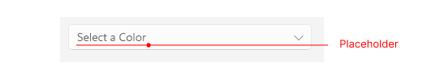

# .NET MAUI TemplatedPicker Visual Structure

The visual structure of the .NET MAUI TemplatedPicker represents the anatomy of the UI control. Being familiar with the visual elements of the TemplatedPicker allows you to quickly find the information required to configure them.

The images in this article show the anatomy of the TemplatedPicker and its building blocks.
## Before and After Selection

- **Placeholder**&mdash;The visualized text before the user picks a value from the popup. You can customize the placeholder through the `PlaceholderTemplate` property. For more information, review the [Templates]() article.

## Popup Visual Structure

- `SelectedItem`&mdash;The item which is highlighted when the popup of the picker is open.

- `Header`&mdash;The header of the popup. For more information, review the [Templates]() article.

- `SelectorTemplate`&mdash;Defines the template used for displaying the selector of the picker. For more information, review the [Templates]() article.

- `Footer`&mdash;The footer of the popup. For more information, review the [Templates]() article.

## See Also

- [Templates]()
- [Styling]()
