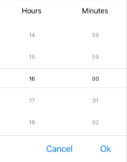

# Time Formatting

The TimePicker for .NET MAUI allows you to use standard or custom time format strings.

To set formatting to the spinners that are displayed when the picker is opened, use the `SpinnerFormat` property. To set formatting to the spinners that are displayed when time is selected, use the `DisplayStringFormat` property.

## DisplayString Format

To define the format of the string that will be visualized when the picker dialog is closed, use the `DisplayStringFormat`(`string`) property.

>note The format set for `DisplayStringFormat` has to be a valid time format. For more information, refer to the [Standard Time Format Strings](#standard-time-format-strings) and [Custom Time Format Strings](#custom-time-format-strings) articles.

The following example shows how to set the `DisplayStringFormat`.

Define the TimePicker.

```XAML
<telerik:RadTimePicker DisplayStringFormat="H:mm"/>
```

Add the namespace.

```XAML
xmlns:telerik="http://schemas.telerik.com/2022/xaml/maui"
```

## Spinner Format

To define the string format for the spinners, use the `SpinnerFormat`(`string`) property. The default format is `"g"`. Depending on what format is set, the picker visualizes spinner controls with pre-populated values that can be picked.

## Standard Time Format Strings

The available standard date and time format strings that can be set to the `SpinnerFormat` and `DisplayStringFormat` properties are described in the table below:

| Supported Standard Time Format String | Description |
| -------- | -------- |
| `"G"` | Short Date and Long Time Format Specifier |
| `"g"` | Short Date and Short Time Format Specifier |
| `"T"` | Long Time Format Specifier |
| `"t"` | Short Time Format Specifier |

>tip For more information on the different formats, refer to the [Standard Date and Time Format Strings](https://docs.microsoft.com/en-us/dotnet/standard/base-types/standard-date-and-time-format-strings) topic on Microsoft Docs.

## Custom Time Format Strings

The available custom time format strings that can be set to the `SpinnerFormat` and `DisplayStringFormat` properties are described in the table below:

The Supported Custom Time Format Strings are: `"H"`, `"HH"`,  `"h"`, `"hh"`, `"m"`, `"mm"`, `"s"`, `"ss"`, `"t"`, `"tt"`.

>tip For more details on the different formats, refer to the [Custom Date and Time Format Strings](https://docs.microsoft.com/en-us/dotnet/standard/base-types/custom-date-and-time-format-strings) topic on Microsoft Docs.

## Supported Separators

When `SpinnerFormat` is set and the device culture is changed, the separators used for the format string won't be changed.

The Supported Time Format Separators are: `"-"`, `"."`, `","`, `" "`, `":"`,`"/"`.

The following example demonstrates how to set `SpinnerFormat="H:mm"`.

```XAML
<telerik:RadTimePicker SpinnerFormat="H:mm" />
```


The following image shows the end result.



## See Also

- [Templates]()
- [Styling]()
- [Commands]()
