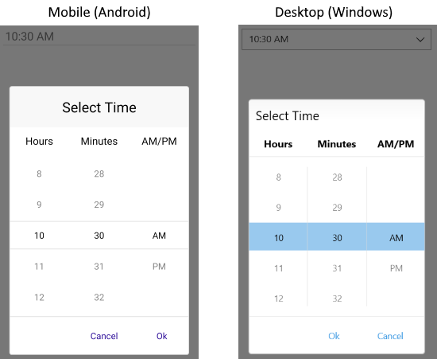
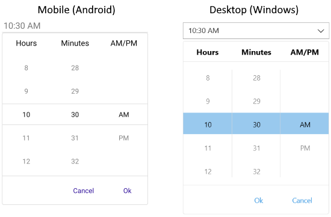

---
title: Picker Mode
page_title: .NET MAUI TimePicker Documentation - Picker Mode
description: "Define PickerMode of Telerik TimePicker for .NET MAUI to either DropDown or Popup."
position: 5
slug: timepicker-picker-mode
---  

# .NET MAUI TimePicker Modes

The TimePicker for .NET MAUI exposes `PickerMode` property of `Telerik.Maui.Controls.PickerMode` type which can be set to one of the following values:

* `Popup`&mdash;Shows the UI for picking a date inside a popup. It's the default value for mobile (Android and iOS);
* `DropDown`&mdash; Opens the UI for picking a date inside a dropdown. It's the default value for Desktop (Windows, macOS);

Here is a sample of `PickerMode` set to `Popup`:

```XAML
<telerik:RadTimePicker Time="10:30:00"
							PickerMode="Popup" />
```

Check below the result on mobile and desktop:



Quick example of `PickerMode` set to `DropDown`:

```XAML
<telerik:RadTimePicker Time="10:30:00"
							PickerMode="DropDown" />
```

Check the result of `DropDown` mode on mobile and desktop:



## Toggle Button

In addition, TimePicker exposes `IsToggleButtonVisible` property which when set to `True` renders an "arrow" button for opening the UI for picking a time. By default, `IsToggleButtonVisible` is enabled for Desktop and is disabled for mobile platforms. Still, you can explicitly apply it in both cases:

```XAML
<telerik:RadTimePicker Time="10:30:00"
							PickerMode="DropDown"
							IsToggleButtonVisible="True" />
```

## See Also

- [Templates]()
- [Styling]()
- [Commands]()
- [Selection]()
