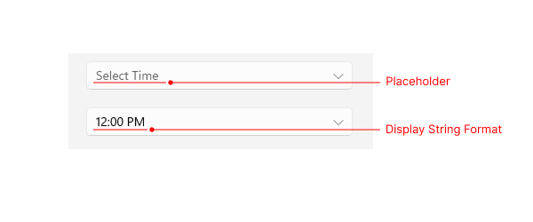
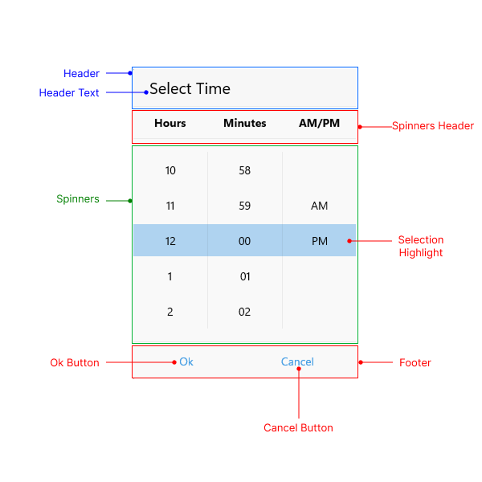

# .NET MAUI TimePicker Visual Structure

The visual structure of the .NET MAUI TimePicker represents the anatomy of the UI control. Being familiar with the visual elements of the TimePicker allows you to quickly find the information required to configure them.

The images in this article show the anatomy of the TimePicker and its building blocks.

## TimePicker Structure

- **Placeholder**&mdash;The text visualized before picking a time value. You can customize the placeholder through the [`PlaceholderTemplate`](#placeholdertemplate) property.
- **DisplayStringFormat**&mdash;The text visualized after a time value is picked.

## Popup Visual Structure

- **Header**&mdash;The text displayed in the popup header. You can set it to a direct text input through the [`HeaderLabelText`](#popup-styling) property or customize the popup header by using the [`HeaderTemplate`](#headertemplate) property.
- **Header Text**&mdash;The text that is visualized in the header of the popup.
- **SpinnerHeader**&mdash;The text visualized for the spinner header depending on the values that are picked. For example, if the `SpinnerFormatString` is `g` and `AreSpinnerHeadersVisible="True"`, the text visualized for the spinner header will be **Hour** **Minutes** **AM/PM**.
- **Spinner**&mdash;Displays items in a list.
- **SelectionHighlight**&mdash;Highlights the currently selected time when the popup is open.
- **Footer**&mdash;The footer of the popup. By default, it contains the **OK** and **Cancel** buttons. It can be customized through the [`FooterTemplate`](#footertemplate) property.

## See Also

- [Getting Started]()
- [Time Format Strings]()
