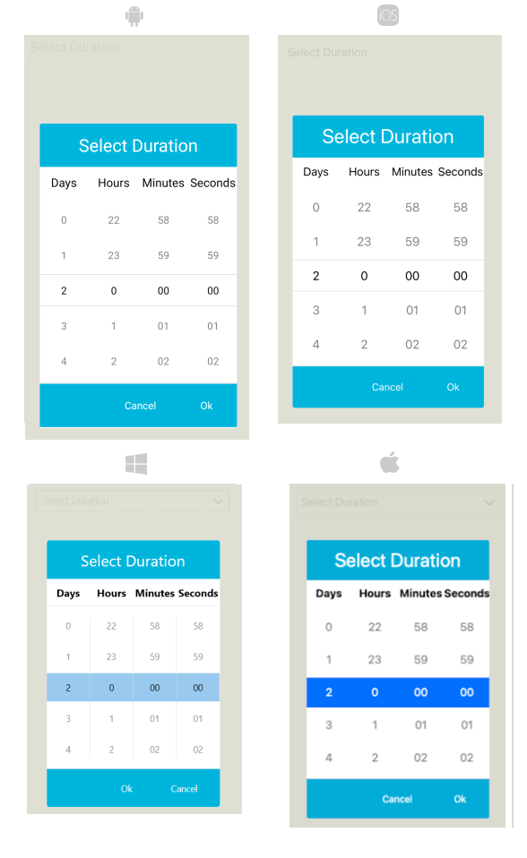

# Popup Styling

The TimeSpanPicker provides a set of options for styling the appearance of its elements such as its spinner, placeholder, and popup, as well as its border style and background color.  

By using the `PopupSettings` property (of type `Telerik.Maui.Controls.PickerPopupSettings`) of the TimeSpanPicker, you can modify the appearance of the dialog (popup).

The `PickerPopupSettings` class exposes the following `Style` properties:

* `PopupViewStyle`(of type `Style` with target type `telerik:PickerPopupContentView`)&mdash;Defines the popup view style.
* `HeaderStyle`(of type `Style` with target type `telerik:PickerPopupHeaderView`)&mdash;Defines the popup header style.
* `HeaderLabelStyle`(of type `Style` with target type `Xamarin.Forms.Label`)&mdash;Defines the popup header label style.
* `FooterStyle`(of type `Style` with target type `telerik:PickerPopupFooterView`)&mdash;Defines the popup footer style.
* `AcceptButtonStyle`(of type `Style` with target type `Button`)&mdash;Defines the **Accept** button style.
* `CancelButtonStyle`(of type `Style` with target type `Button`)&mdash;Defines the **Cancel** button style.

The `PickerPopupSettings` also provides the following properties for popup customization:

* `PopupOutsideBackgroundColor`&mdash;Defines the color outside of the popup.
* `IsPopupModal`(`bool`)&mdash;Defines a boolean value indicating if the popup will be closed when users click outside the popup.
	* When `IsPopupModal="True"`, the UI behind the popup gets inactive and cannot be used until the popup is closed.
	* When `IsPopupModal="False"`, the popup can be closed when clicking outside the popup. By default, the value of the `IsPopupModal` is `false`.

* `HeaderLabelText`(`string`)&mdash;Specifies the text visualized in the popup header.
* `IsHeaderVisible`(`bool`)&mdash;Specifies whether the popup header is currently visible. By default, the value is `True`.
* `IsFooterVisible`(`bool`)&mdash;Specifies whether the popup footer is currently visible. By default, the value is `True`.
* `AcceptButtonText`(`string`)&mdash;Defines the text visualized for the **Accept** button. By default, the text is `OK`.
* `CancelButtonText`(`string`)&mdash;Defines the text visualized for the **Cancel** button. By default, the text is `Cancel`.

> __PopupSettings__ provides styling options for the popup, its header and footer, outside background color and other. If you need to customize the look&feel of the spinner controls that show the available time values, please refer to `SpinnerStyle`, `SpinnerHeaderStyle` and `SelectionHighlightStyle` properties of the TimeSpanPicker. For more detailed information on them go to [TimeSpanPicker Styling]() topic.

## Namespaces

When defining some of these styles, you will need to include additional namespaces, so that the target types are properly resolved.

If you use `PopupViewStyle`, `HeaderStyle`, or `FooterStyle`, you will need to add the following namespace:

```XAML
xmlns:telerik="http://schemas.telerik.com/2022/xaml/maui"
```

## Example

The following example shows how the styling properties are applied.

Let's have the following `TimeSpan Picker` definition:

<snippet id='timespanpicker-style' />

And here are how the styles are defined in the page resources.

## PopupView Style

```XAML
<Style TargetType="telerik:PickerPopupContentView" x:Key="popupViewStyle">
    <Setter Property="BackgroundColor" Value="White"/>
    <Setter Property="WidthRequest" Value="270"/>
</Style>
```

## Header Style

```XAML
<Style TargetType="telerik:PickerPopupHeaderView" x:Key="headerStyle">
    <Setter Property="BackgroundColor" Value="#00B5DC"/>
    <Setter Property="HeightRequest" Value="60"/>
    <Setter Property="Margin" Value="0"/>
    <Setter Property="Padding" Value="0"/>
    <Setter Property="HorizontalOptions" Value="FillAndExpand"/>
    <Setter Property="VerticalOptions" Value="FillAndExpand"/>
</Style>
```

## HeaderLabel Style

```XAML
<Style TargetType="Label" x:Key="headerLabelStyle">
    <Setter Property="TextColor" Value="White"/>
    <Setter Property="HorizontalOptions" Value="Center"/>
    <Setter Property="VerticalOptions" Value="Center"/>
    <Setter Property="FontSize" Value="Title"/>
</Style>
```

## Footer Style

```XAML
<Style TargetType="telerik:PickerPopupFooterView" x:Key="footerStyle">
    <Setter Property="BackgroundColor" Value="#00B5DC"/>
</Style>
```

## AcceptButton Style

```XAML
<Style TargetType="Button" x:Key="acceptButtonStyle">
    <Setter Property="BackgroundColor" Value="Transparent"/>
    <Setter Property="Text" Value="Accept"/>
    <Setter Property="TextColor" Value="White"/>
</Style>
```

## CancelButton Style

```XAML
<Style TargetType="Button" x:Key="cancelButtonStyle">
    <Setter Property="BackgroundColor" Value="Transparent"/>
    <Setter Property="Text" Value="Reject"/>
    <Setter Property="TextColor" Value="White"/>
</Style>
```

## Namespaces

```XAML
xmlns:telerik="http://schemas.telerik.com/2022/xaml/maui"
```

This is how the TimeSpanPicker control looks when the styles described above are applied:



## See Also

- [TimeSpanPicker Styling]()
- [Custom Templates]()
- [Commands]()
- [Visual Structure]()
