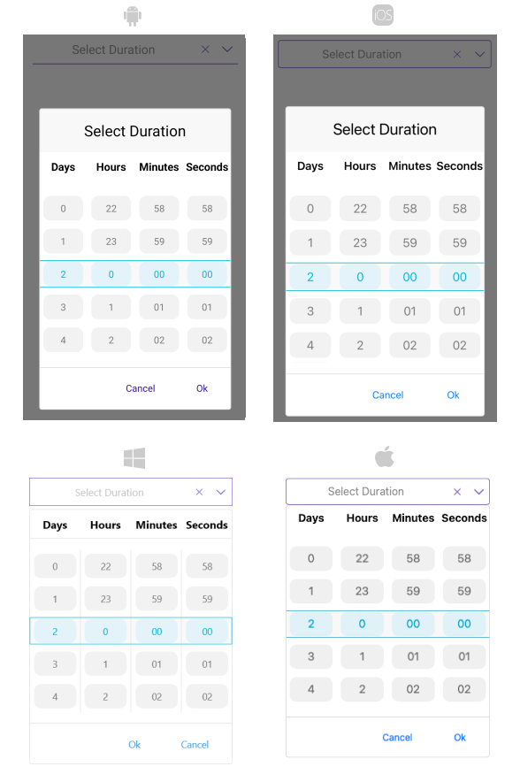

# Styling

The TimeSpanPicker provides a set of options for styling the appearance of its elements such as its spinner, placeholder, and popup, as well as its border style and background color.  

## TimeSpanPicker Styling

The TimeSpanPicker control for .NET MAUI provides the following `Style` properties for customizing its look:

* `SpinnerStyle`(of type `Style` with target type `telerikDataControls:RadSpinner`)&mdash;Defines the style applied to the spinner item and the selected item interval.
* `SpinnerHeaderStyle`(of type `Style` with target type `Label`)&mdash;Specifies the style applied to the spinner header labels.
* `SelectionHighlightStyle`(of type `Style` with target type `telerikPrimitives:RadBorder`)&mdash;Specifies the style applied to the selection inside the popup.
* `PlaceholderLabelStyle`(of type `Style` with target type `Label`)&mdash;Defines the style applied to the placeholder label.
* `DisplayLabelStyle`(of type `Style` with target type `Label`)&mdash;Defines the style applied to the label which is visualized when a time duration is selected.

In addition, the TimeSpanPicker exposes the following properties for specifying its border style and background color:

* `BackgroundColor`&mdash;Defines the background color of the picker.
* `BorderColor`&mdash;Defines the border color of the picker.
* `BorderThickness`&mdash;Specifies the border thickness of the picker. The default value is `new Thickness(0,0,0,1)`.
* `CornerRadius`&mdash;Specifies the corner radius of the picker.

## Popup Styling

By using the `SelectorSettings` property (of type `Telerik.XamarinForms.Input.PickerPopupSelectorSettings`) of the TimeSpanPicker you can modify the appearance of the dialog (popup).

The `PickerPopupSelectorSettings` class exposes the following `Style` properties:

* `PopupViewStyle`(of type `Style` with target type `telerikInput:PickerPopupContentView`)&mdash;Defines the popup view style.
* `HeaderStyle`(of type `Style` with target type `telerikInput:PickerPopupHeaderView`)&mdash;Defines the popup header style.
* `HeaderLabelStyle`(of type `Style` with target type `Xamarin.Forms.Label`)&mdash;Defines the popup header label style.
* `FooterStyle`(of type `Style` with target type `telerikInput:PickerPopupFooterView`)&mdash;Defines the popup footer style.
* `AcceptButtonStyle`(of type `Style` with target type `Button`)&mdash;Defines the **Accept** button style.
* `CancelButtonStyle`(of type `Style` with target type `Button`)&mdash;Defines the **Cancel** button style.

The `SelectorSettings` also provides the following properties for popup customization:

* `PopupOutsideBackgroundColor`&mdash;Defines the color outside of the popup.
* `IsPopupModal`(`bool`)&mdash;Defines a boolean value indicating if the popup will be closed when users click outside the popup.
	* When `IsPopupModal="True"`, the UI behind the popup gets inactive and cannot be used until the popup is closed.
	* When `IsPopupModal="False"`, the popup can be closed when clicking outside the popup. By default, the value of the `IsPopupModal` is `false`.

* `HeaderLabelText`(`string`)&mdash;Specifies the text visualized in the popup header.
* `IsHeaderVisible`(`bool`)&mdash;Specifies whether the popup header is currently visible. By default, the value is `True`.
* `IsFooterVisible`(`bool`)&mdash;Specifies whether the popup footer is currently visible. By default, the value is `True`.
* `AcceptButtonText`(`string`)&mdash;Defines the text visualized for the **Accept** button. By default, the text is `OK`.
* `CancelButtonText`(`string`)&mdash;Defines the text visualized for the **Cancel** button. By default, the text is `Cancel`.

## Namespaces

When defining some of these styles, you will need to include additional namespaces, so that the target types are properly resolved.

If you use `PopupViewStyle`, `HeaderStyle`, or `FooterStyle`, you will need to add the following namespace:

```XAML
xmlns:telerikInput="clr-namespace:Telerik.XamarinForms.Input;assembly=Telerik.Maui.Controls.Compatibility"
```

If you use `SelectionHighlightStyle`, you need to add the following namespace:

```XAML
xmlns:telerik="clr-namespace:Telerik.Maui.Controls;assembly=Telerik.Maui.Controls"
```

If you use `SpinnerStyle`, you need to add the following namespace:

```XAML
xmlns:telerikDataControls="clr-namespace:Telerik.XamarinForms.DataControls;assembly=Telerik.Maui.Controls.Compatibility"
```

## Example

The following example shows how the styling properties are applied.

Let's have the following `TimeSpan Picker` definition:

<snippet id='timespanpicker-style' />

And here are how the styles are defined in the page resources.

## Spinner Style

**Example for Setting the Spinner Style**

```XAML
<Style TargetType="telerikDataControls:RadSpinner" x:Key="spinnerStyle">
    <Setter Property="ItemStyle">
        <Setter.Value>
            <Style TargetType="telerikDataControls:SpinnerItemView">
                <Setter Property="TextColor" Value="#797979" />
                <Setter Property="BackgroundColor" Value="#F2F2F2" />
                <Setter Property="CornerRadius" Value="10" />
                <Setter Property="Margin" Value="6, 4" />
            </Style>
        </Setter.Value>
    </Setter>
    <Setter Property="SelectedItemStyle">
        <Setter.Value>
            <Style TargetType="telerikDataControls:SpinnerItemView">
                <Setter Property="TextColor" Value="#00B5DC" />
                <Setter Property="BackgroundColor" Value="#E4F3F9" />
                <Setter Property="CornerRadius" Value="10" />
                <Setter Property="Margin" Value="6, 4" />
            </Style>
        </Setter.Value>
    </Setter>
</Style>
```

## SpinnerHeader Style

```XAML
<Style TargetType="Label" x:Key="spinnerHeaderStyle">
    <Setter Property="TextColor" Value="Black"/>
    <Setter Property="FontAttributes" Value="Bold"/>
    <Setter Property="HorizontalOptions" Value="FillAndExpand"/>
    <Setter Property="VerticalOptions" Value="FillAndExpand"/>
    <Setter Property="HorizontalTextAlignment" Value="Center"/>
    <Setter Property="VerticalTextAlignment" Value="Center"/>
</Style>
```

## SelectionHighlight Style

```XAML
 <Style TargetType="telerik:RadBorder" x:Key="selectionHighlightStyle">
    <Setter Property="BorderColor" Value="#00B5DC"/>
    <Setter Property="BorderThickness" Value="1"/>
    <Setter Property="Padding" Value="0,6,0,6"/>
    <Setter Property="HeightRequest" Value="40"/>
    <Setter Property="VerticalOptions" Value="Center"/>
    <Setter Property="BackgroundColor" Value="#F9F9F9"/>
</Style>
```

## PlaceholderLabel Style

```XAML
<Style TargetType="Label" x:Key="placeholderLabelStyle">
    <Setter Property="TextColor" Value="#1188FF"/>
    <Setter Property="VerticalTextAlignment" Value="Center"/>
    <Setter Property="HorizontalTextAlignment" Value="Center"/>
    <Setter Property="HeightRequest" Value="50"/>
</Style>
```

## DisplayLabel Style

```XAML
<Style TargetType="Label" x:Key="displayLabelStyle">
    <Setter Property="TextColor" Value="#1188FF"/>
    <Setter Property="VerticalTextAlignment" Value="Center"/>
    <Setter Property="HorizontalTextAlignment" Value="Center"/>
    <Setter Property="HeightRequest" Value="50"/>
</Style>
```

## PopupView Style

```XAML
<Style TargetType="telerikInput:PickerPopupContentView" x:Key="popupViewStyle">
    <Setter Property="BackgroundColor" Value="White"/>
    <Setter Property="WidthRequest" Value="270"/>
</Style>
```

## Header Style

```XAML
<Style TargetType="telerikInput:PickerPopupHeaderView" x:Key="headerStyle">
    <Setter Property="BackgroundColor" Value="#00B5DC"/>
    <Setter Property="HeightRequest" Value="60"/>
    <Setter Property="Margin" Value="0"/>
    <Setter Property="Padding" Value="0"/>
    <Setter Property="HorizontalOptions" Value="FillAndExpand"/>
    <Setter Property="VerticalOptions" Value="FillAndExpand"/>
</Style>
```

## HeaderLabel Style

```XAML
<Style TargetType="Label" x:Key="headerLabelStyle">
    <Setter Property="TextColor" Value="White"/>
    <Setter Property="HorizontalOptions" Value="Center"/>
    <Setter Property="VerticalOptions" Value="Center"/>
    <Setter Property="FontSize" Value="Title"/>
</Style>
```

## Footer Style

```XAML
<Style TargetType="telerikInput:PickerPopupFooterView" x:Key="footerStyle">
    <Setter Property="BackgroundColor" Value="#00B5DC"/>
</Style>
```

## AcceptButton Style

```XAML
<Style TargetType="Button" x:Key="acceptButtonStyle">
    <Setter Property="BackgroundColor" Value="Transparent"/>
    <Setter Property="Text" Value="Accept"/>
    <Setter Property="TextColor" Value="White"/>
</Style>
```

## CancelButton Style

```XAML
<Style TargetType="Button" x:Key="cancelButtonStyle">
    <Setter Property="BackgroundColor" Value="Transparent"/>
    <Setter Property="Text" Value="Reject"/>
    <Setter Property="TextColor" Value="White"/>
</Style>
```

## Namespaces

```XAML
xmlns:telerik="clr-namespace:Telerik.Maui.Controls;assembly=Telerik.Maui.Controls"
xmlns:telerikInput="clr-namespace:Telerik.XamarinForms.Input;assembly=Telerik.Maui.Controls.Compatibility"
xmlns:telerikPrimitives="clr-namespace:Telerik.XamarinForms.Primitives;assembly=Telerik.Maui.Controls.Compatibility"
xmlns:telerikDataControls="clr-namespace:Telerik.XamarinForms.DataControls;assembly=Telerik.Maui.Controls.Compatibility"
```

This is how the TimeSpanPicker control looks when the styles described above are applied:



## See Also

- [Custom Templates]()
- [Commands]()
- [Visual Structure]()
