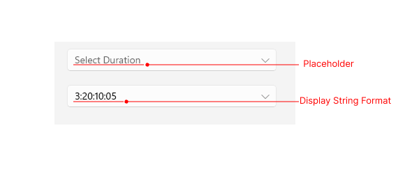

# Visual Structure

This article describes all visual elements that are used in the TimeSpanPicker for .NET MAUI.

## Before and after Time Interval Selection

## Popup Visual Structure

>note Currently, the TimeSpanPicker does not provide spinners for milliseconds.

## Legend

- **Placeholder**&mdash;The text visualized before the user picks a date/time. You can customize the placeholder through the [`PlaceholderTemplate`](#placeholdertemplate) property.

- **DisplayStringFormat**&mdash;The text visualized after a date/time is picked.

- **Header** and **HeaderLabelText**&mdash;The text displayed in the popup header. You can set it to a direct text input through the [`HeaderLabelText`]() property or fully customize the popup header by using the [`HeaderTemplate`](#headertemplate) property.

- **SpinnersHeader**&mdash;The text visualized for the spinner header depending on the values that will be picked. For example, if the `SpinnerFormat` is `g`, the text visualized for the spinner header will be **Days** **Hours** **Minutes** **Seconds**.

- **Spinner**&mdash;Displays time interval values in a list.

- **SelectionHighlight**&mdash;Highlights the currently selected time interval when the popup is open.

- **Footer**&mdash;The footer of the popup. By default, it contains the **OK** and **Cancel** buttons. You can customize it through the [`FooterTemplate`](#footertemplate) property.

## See Also

- [Templates]()
- [Commands]()
