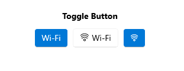

# .NET MAUI ToggleButton Overview

The Telerik UI for .NET MAUI ToggleButton component represents a button that can be toggled between two states: toggled and untoggled. It allows end users to select or toggle an option or a state in an application's user interface.

The ToggleButton is commonly used in scenarios to capture and represent a binary choice, such as enabling or disabling a feature, activating or deactivating a setting, or toggling between two different modes or views.

## Key Features of the .NET MAUI ToggleButton

* [Toggled states]()&mdash;The ToggleButton delivers options for setting its state to toggled and untoggled, and provides an additional indeterminate state which indicates the control is neither toggled nor untoggled.
* [Setting three state](#setting-three-states)&mdash;You can apply indeterminate state through the UI by setting `IsThreeState` property.
* [Content and ContentTemplate](#setting-content)&mdash;The ToggleButton allows you to define a `Content`. In addition, there is an option for setting `ContentTemplate`.
* [Text alignment](#text-alignment)&mdash;The ToggleButton enables you to control the horizontal and vertical positioning of the text inside the content.
* [Visual states]()&mdash;You can change the ToggleButton appearance for different visual states like, `Normal`, `Pressed`, `MouseOver` (desktop-only), `Toggled`, `Disabled`, and more.
* [Exhaustive number of events]()&mdash;You can use the events exposed by the ToggleButton to execute various operations on user interaction such as click, press, release, and changing toggle state.
* [Command]()&mdash;The ToggleButton provides a command, that executes when the button is clicked.
* [Styling]()&mdash;You can apply different styling options to the button such as changing its background color, border color, border thickness and more.

## Next Steps

- [Getting Started with Telerik UI for .NET MAUI ToggleButton]()

## See Also

- <a href="https://www.telerik.com/maui-ui/togglebutton" target="_blank">.NET MAUI ToggleButton Product Page</a>
- <a href="https://www.telerik.com/forums/maui?tagId=2057" target="_blank">.NET MAUI ToggleButton Forum Page</a>
- <a href="https://www.telerik.com/blogs/mobile-net-maui" target="_blank">Telerik .NET MAUI Blogs</a>
- <a href="https://www.telerik.com/support/whats-new/maui-ui/roadmap" target="_blank">Telerik .NET MAUI Roadmap</a>