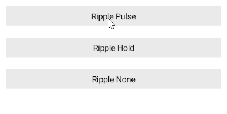

# (Android-only) .NET MAUI ToggleButton Ripple Effect

Apply a ripple effect to the ToggleButton, by using the following attached properties of the `RadEffects` class:

* `RippleColor` (`Color`)&mdash;Specifies the color of the ripple effect.
* `RippleMode` (enum of type `Telerik.Maui.Theming.RippleMode`)&mdash;Specifies the mode in which the ripple effect can be visualized. The options are:
	* (Default)`Pulse`&mdash;The element will play a ripple effect on pressed and the ripple will fade away even on hold.
	* `Hold`&mdash;The element will play a ripple effect on pressed and flood the element while held.
	* `None`&mdash;The element will not render ripple effects.

> The ripple effect is available on Android.


### Customizing the Ripple Effect

The following example demonstrates how to customize the ripple effect of the ToggleButton by changing the `RippleMode` and `RippleColor`.

**1.** Define the buttons in XAML:

<snippet id='togglebutton-ripple-effect' />

**2.** Define the following snippet to the page's resources to customize the `RippleColor` when ToggleButton is pressed. 

<snippet id='togglebutton-ripple-visual-states-resources' />

**3.** Add the `telerik` namespace:

```XAML
xmlns:telerik="http://schemas.telerik.com/2022/xaml/maui"
```

This is the result on Android:



> For a runnable example demonstrating the customization of the ToggleButton ripple effect, see the [SDKBrowser Demo Application]() and go to **ToggleButton > Features** category.

## See Also

- [Configure the ToggleButton]()
- [Toggle State]()
- [Set Visual States]()
- [Events]()
- [Execute Command]()
- [Style the ToggleButton]()

