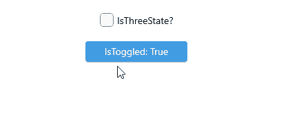

# Toggle States for .NET MAUI ToggleButton

The ToggleButton enables you to define its state as `Toggled`, `Untoggled`, or `Indeterminate`.

The state is controlled through the `IsToggled`(`bool?`) property. You can set all states either through the UI or programmatically. The `Indeterminate` state can be applied through the UI only for three-state checkboxes. The `IsToggled` property default binding mode is `TwoWay`.

* (Default) `Untoggled` state&mdash;When `IsToggled` is `false`.

* `Toggled` state&mdash;When `IsToggled` is `true`.

* `Indeterminate` state&mdash;When `IsToggled` is `null`.

## Setting Three States

The ToggleButton enables you to apply the indeterminate state through the UI by setting the `IsThreeState` (`bool`) property. When `IsThreeState` is `true`, it allows the end user to go to the indeterminate state along with the `Toggled` and `Untoggled` states. By default, `IsThreeState` is `false`.

The following example demonstrates how to set the `IsThreeState` property.

**1.** Set the `IsThreeState` property of the `RadToggleButton`:`

<snippet id='togglebutton-three-state' />

**2.** Add the `telerik` namespace:

```XAML
xmlns:telerik="http://schemas.telerik.com/2022/xaml/maui"
```

**3.** This is the result on WinUI:



## Events

* `IsToggledChanged`&mdash;Occurs when the `RadCheckBox.IsToggled` property is changed. The `IsToggledChanged` event handler receives two parameters:
    * The `sender` which is of type `Telerik.Maui.Controls.RadToggleButton`.
    * `ValueChangedEventArgs` which provides the following properties:
        * `NewValue`(`TValue`)&mdash;Gets the new value from the `IsToggled` property.
        * `PreviousValue`(`TValue`)&mdash;Gets the previous value of the `IsToggled` property.

## See Also

- [Configure the ToggleButton]()
- [Set Visual States]()
- [Events]()
- [Execute Command]()
- [Style the ToggleButton]()
