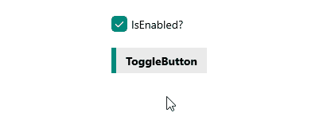

# .NET MAUI ToggleButton Visual States

The ToggleButton provides the following `CommonStates` visual states described in the table below:

| Visual States | Description |
| ------------- | --------------- |
| `Normal` | Applies when the button is in normal state |
| `Pressed` | Applies when the button is pressed |
| `MouseOver` | Applies when the mouse pointer hovers over the control - applicable for Desktop |
| `Disabled` | Applies when the button is disabled |
| `Toggled` | Applies when the button is toggled |
| `ToggledMouseOver` | Applies when the button is toggled and the mouse is over the button |
| `ToggledPressed` | Applies when the button is toggled and pressed |
| `ToggledDisabled` | Applies when the button is toggled and disabled |
| `Indeterminate` | Applies when the button is in indeterminate state |
| `IndeterminateMouseOver` | Applies when the button is in indeterminate state and the mouseis over the button |
| `IndeterminatePressed` | Applies when the button is in indeterminate state and pressed |
| `IndeterminateDisabled` | Applies when the button is in indeterminate state and disabled |

The ToggleButton provides the following `FocusStates` visual states described in the table below:

| Visual States | Description |
| ------------- | --------------- |
| `Unfocused` | Applies when the button is in normal state |
| `Focused` | Applies when the button is pressed |

### Using the Visual States

The following example demonstrates how to use the ToggleButton Visual States.

**1.** Define the ToggleButton in XAML:

<snippet id='togglebutton-visual-states' />

**2.** Define the Visual States in the page's resources:

<snippet id='togglebutton-visual-states-resources' />

**3.** Add the `telerik` namespace:

```XAML
xmlns:telerik="http://schemas.telerik.com/2022/xaml/maui"
```

This is the result on WinUI: 



>tip For a runnable example demonstrating the ToggleButton visual state, see the [SDKBrowser Demo Application]() and go to the **ToggleButton > Features** category.

## See Also

- [Configure the ToggleButton]()
- [Toggle State]()
- [Events]()
- [Execute Command]()
- [Style the ToggleButton]()
