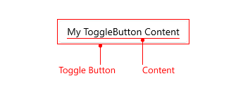

# .NET MAUI ToggleButton Visual Structure

The visual structure of the .NET MAUI ToggleButton represents the anatomy of the UI component. Being familiar with the visual elements of the Calendar allows you to quickly find the information required to configure them.

The following image shows the anatomy of the ToggleButton.

## Displayed Elements

## See Also

- [.NET MAUI ToggleButton Product Page](https://www.telerik.com/maui-ui/togglebutton)
- [.NET MAUI ToggleButton Forum Page](https://www.telerik.com/forums/maui?tagId=2057)
- [Telerik .NET MAUI Blogs](https://www.telerik.com/blogs/mobile-net-maui)
- [Telerik .NET MAUI Roadmap](https://www.telerik.com/support/whats-new/maui-ui/roadmap)
