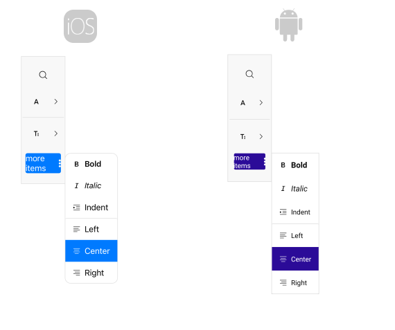
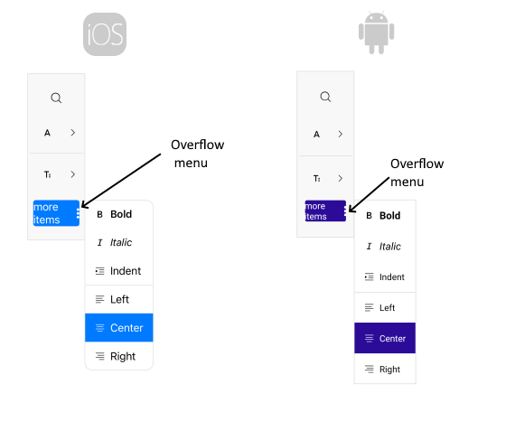
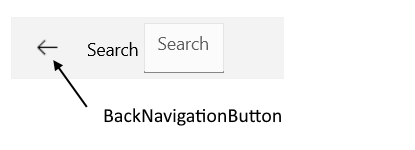

# .NET MAUI Toolbar Configuration

This article describes all configuration options available in the .NET MAUI Toolbar control.

## Orientation

* By setting the `Orientation`(enum of type`Telerik.Maui.Controls.ToolbarOrientation`) property you can specify rhe orientation of the toolbar. The available options are `Horizontal` and `Vertical`. The default value is `Horizontal.`

## Spacing between the toolbar items

* `ItemSpacing`(`double`)&mdash;Specifies the spacing in pixels between the items in the toolbar. The default value is `8`.

## Spacing between the elements in the toolbar items

* `LineSpacing`(`double`)&mdash;Specifies the spacing in pixels between the lines of items in the toolbar. This property has effect when the toolbar is in a multi-line wrap overflow mode. The default value is `8`.

* `OptionsPanel`(`Telerik.Maui.Controls.RadToolbarOptionsPanel`)&mdash;Specifies the options panel associated with this toolbar.

## Toolbar Items

* `Items`(`IList<ToolbarItem>`)&mdash;Read-only collection of `ToolbarItems`.

>important All built-in toolbar items are desctibed in the [Toolbar Items]() section.

## Overflow menu

When the items cannot fit in the toolbar available space an overflow menu is displayed. The properties related to the Overflow menu are: 

* `OverflowMode`(enum of type `Telerik.Maui.Controls.ToolbarOverflowMode`)&mdash; Specifies the overflow mode when the items in the toolbar cannot fit in the available space. The available options are:
	* `DropDown`(the default mode)&mdash;When the toolbar items cannot fit in the available space, they are placed in the overflow drop-down menu.
	* `Scroll`&mdash;When the toolbar items cannot fit in the available space, they are scrolled horizontally or vertically, based on the orienatation of the toolbar.
	* `Wrap`&mdash;When the toolbar items cannot fit in the available space, they are wrapped horizontally or vertically on multiple lines, based on the orientation of the toolbar.

* `OverflowMenuButtonVisibility`(enum of type `Telerik.Maui.Controls.ToolbarButtonVisibilityMode`)&mdash;Specifies the visibility mode of the overflow menu button in the toolbar. The available options are:
	* `Auto`(the default mode)&mdash;The button visibility is determined automatically, based on the associated command.
	* `Visible`(the default mode)&mdash;The button is always visible in the toolbar, regardless of the associated command.
	* `Hidden`(the default mode)&mdash;The button is always hidden from the toolbar, regardless of the associated command.

* `OverflowMenuButtonTemplate`(`ControlTemplate`)&mdash;Defines the ControlTemplate applied to the overflow menu button in the toolbar.
* `OverflowItems`(`IReadOnlyList<ToolbarItem>`)&mdash;Read-only collection of `Telerik.Maui.Controls.ToolbarItems` that are in the overflow area of the toolbar.
* `OverflowMenuButtonStyle`(`Style` with target type `Telerik.Maui.Controls.OverflowMenuButtonToolbarItemView`)&mdash;Specifies the style applied to the Overflow menu button. The properties that can be applied through style are the properties applicable for [DropDownButtonToolbarItemView](#styling), [ButtonToolbarItemView](#styling), [ToolbarItemView](#styling) and [LabelToolbarItemView](#styling).

## Separator between the toolbar items

You can easily separate the toolbar items using the `[SeparatorToolbarItem]()`.

## Back navigation button

* `BackNavigationButtonVisibility`(enum of type `Telerik.Maui.Controls.ToolbarButtonVisibilityMode`)&mdash;Specifies the visibility mode of the back navigation button in the toolbar. The available options are:
	* `Auto`(the default mode)&mdash;The button visibility is determined automatically, based on the associated command.
	* `Visible`(the default mode)&mdash;The button is always visible in the toolbar, regardless of the associated command.
	* `Hidden`(the default mode)&mdash;The button is always hidden from the toolbar, regardless of the associated command.

* `BackNavigationButtonTemplate`(`ControlTemplate`)&mdash;Defines the ControlTemplate applied to the back navigation button in the toolbar.
* `BackNavigationButtonStyle`(`Style` with target type `Telerik.Maui.Controls.BackNavigationButtonToolbarItemView`)&mdash;Specifies the style applied to the back navigation button.

## Scroll buttons

Properties related to the scroll buttons configuration are:

* `ScrollButtonsVisibility`(enum of type `Telerik.Maui.Controls.ToolbarButtonVisibilityMode`)&mdash;Specifies the visibility mode of the scroll buttons in the toolbar. The available options are:
	* `Auto`(the default mode)&mdash;The button visibility is determined automatically, based on the associated command.
	* `Visible`(the default mode)&mdash;The button is always visible in the toolbar, regardless of the associated command.
	* `Hidden`(the default mode)&mdash;The button is always hidden from the toolbar, regardless of the associated command.

* `ScrollForwardButtonTemplate`(`ControlTemplate`)&mdash;Definess the ControlTemplate applied to the forward scroll button in the toolbar.
* `ScrollForwardButtonStyle`(`Style` with target type `Telerik.Maui.Controls.ScrollForwardButtonToolbarItemView`)&mdash;Definess the style applied to the forward scroll button in the toolbar.
* `ScrollBackwardButtonTemplate`(`ControlTemplate`)&mdash;Definess the ControlTemplate applied to the backward dscroll button in the toolbar.
* `ScrollBackwardButtonStyle`(`Style` with target type `Telerik.Maui.Controls.ScrollBackwardButtonToolbarItemView`)&mdash;Definess the style applied to the backward scroll button in the toolbar.

## See Also

- [Toolbar Items]()
- [Styling]()
- [Commands]()
