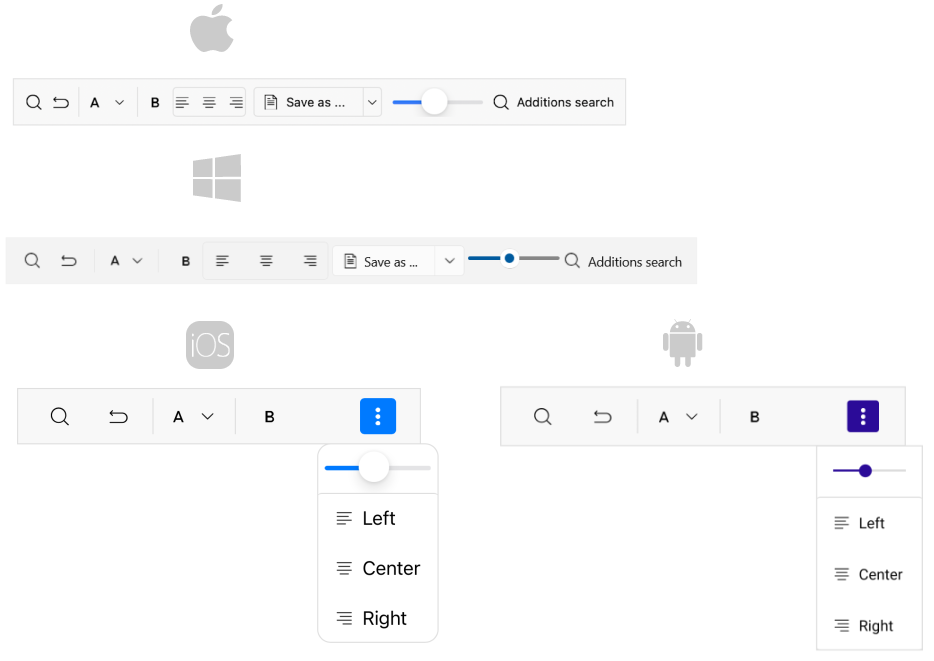

# Getting Started with .NET MAUI Toolbar control

This guide provides the information you need to start using the Telerik UI for .NET MAUI Toolbar by adding the control to your project.

At the end, you will be able to achieve the following result.



## Prerequisites

Before adding the ImageEditor, you need to:

1. [Set up your .NET MAUI application](#set-up-your-net-maui-application).

1. [Download Telerik UI for .NET MAUI](#download-telerik-ui-for-net-maui).

1. [Install Telerik UI for .NET MAUI](#install-telerik-ui-for-net-maui).

## Define the Control

**1.** When the your .NET MAUI application is set up, you are ready to add an Toolbar control to your page.

```XAML
 <telerik:RadToolbar x:Name="toolbar"/>
```

**2.** Add the following namespace:

 ```XAML
xmlns:telerik="http://schemas.telerik.com/2022/xaml/maui"
 ```

**3.** Add Toolbar items to the RadToolbar control:

<snippet id='toolbar-getting-started'/>

**4.** Register the Telerik controls through the `Telerik.Maui.Controls.Compatibility.UseTelerik` extension method called inside the `CreateMauiApp` method of the `MauiProgram.cs` file of your project:

```C#
 using Telerik.Maui.Controls.Compatibility;

 public static class MauiProgram
 {
	public static MauiApp CreateMauiApp()
	{
		var builder = MauiApp.CreateBuilder();
		builder
			.UseTelerik()
			.UseMauiApp<App>()
			.ConfigureFonts(fonts =>
			{
				fonts.AddFont("OpenSans-Regular.ttf", "OpenSansRegular");
			});

		return builder.Build();
	}
 }           
```

## Additional Resources

- [.NET Toolbar page](https://www.telerik.com/maui-ui/toolbar)
- [.NET MAUI Toolbar forum page](https://www.telerik.com/forums/maui?tagId=1781)
- [Telerik .NET MAUI blogs](https://www.telerik.com/blogs/mobile-net-maui)
- [Telerik .NET MAUI roadmap](https://www.telerik.com/support/whats-new/maui-ui/roadmap)

## See Also

- [Configuration]()
- [ToolbarItems]()
- [Commands]()

