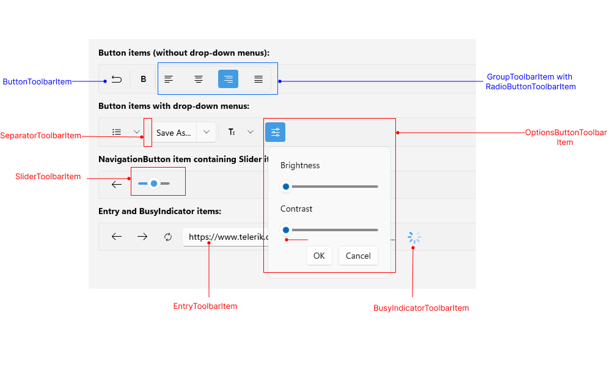

# .NET MAUI ToolbarItem Overview

The Telerik .NET MAUI Toolbar provides built-in toolbar items. The available items are described in the table below: 

| Toolbar Item | Description |
| ------------ | ------- |
| `ToolbarItem` | Represents a toolbar item in the Toolbar control. All toolbar items listed below inherits from `ToolbarItem` |
| `EntryToolbarItem` | Represents an entry toolbar item in the Toolbar control. |
| `ButtonToolbarItem` | Represents a button in the Toolbar control. |
| `DropDownButtonToolbarItem` | Represents a button displaying a drop-down panel in the Toolbar control. |
| `DropDownMenuButtonToolbarItem` | Represents a button displaying a drop-down menu in the Toolbar control. |
| `ToggleButtonToolbarItem` | Represents a toggle button in the Toolbar control. |
| `RadioButtonToolbarItem` | Represents a radio button in the Toolbar control. |
| `NavigationButtonToolbarItem` | Represents a navigation button in the Toolbar control. |
| `SplitButtonToolbarItem` | Represents a split button in the Toolbar control. Works as an advanced drop-down menu. |
| `OptionsButtonToolbarItem` | Represents a button displaying an options panel in the RadToolbar control. |
| `SliderToolbarItem` | Represents a slider in the Toolbar control |
| `ListPickerButtonToolbarItem` | Represents a list picker button in the Toolbar control. |
| `LabelToolbarItem` | Represents a label in the Toolbar control. The label can display a text and optionally an image next to it. |
| `BusyIndicatorToolbarItem` | Represents a busy indicator in the Toolbar control. |
| `SeparatorToolbarItem` | Represents a separator(which is an UI element) in the Toolbar control. |
| `GroupToolbarItem` | Organize toolbar items in a group. |

In addition, you can define an option panel in the toolbar using the `RadToolbarOptionsPanel`.

## Common properties for configuration 

All toolbar items inherits from `ToolbarItem`. The available properties ToolbarItem provides are:

* `IsVisible`(`bool`)&mdash;Specifies whether the toolbar item is visible.
* `IsEnabled`(`bool`)&mdash;Specifies whether the toolbar item is enabled.
* `Style`(`Style`)&mdash;Specifies the style applied to the toolbar item. Each toolbar item has a corresponding `ToolbarItemView`. And this is the target type of the Style.

For example the target type for `ButtonToolbarItem` `Style` is `ButtonToolbarItemView`.

* `ControlTemplate`(`Microsoft.Maui.Controls.ControlTemplate`)&mdash;Specifies the template applied to the toolbar item. Each toolbar item has a corresponding `ToolbarItemView`. And this is the target type of the `ControlTemplate`.

* `PlacementOptions`(enum of type `Telerik.Maui.Controls.ToolbarItemPlacementOptions`)&mdash;Defines the allowed placement options of the toolbar item in the toolbar. This type supports a bitwise combination of its members to enable more than one option. The available options are:
	* `ToolStrip`&mdash;The toolbar item appears in the main tool strip area of the toolbar.
	* `DropDown`&mdash;The toolbar item appears in the overflow drop-down menu of the toolbar.

## Styling

@[template](/_contentTemplates/controls/toolbar.md#toolbar-styling)

## See Also

- [SplitButton ToolbarItem]()
- [ToggleButton ToolbarItem]()
- [Label ToolbarItem]()
- [NavigationButton ToolbarItem]()
- [ListPicker ToolbarItem]()
- [Group ToolbarItem]()
- [RadioButton ToolbarItem]()
- [Slider ToolbarItem]()