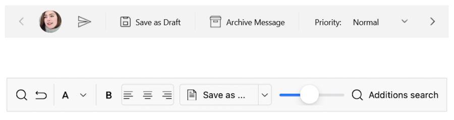

# .NET MAUI Toolbar Overview

The Telerik .NET MAUI Toolbar is a flexible component for implementation of tool and button strips, needed in most desktop and mobile applications. The individual items of the control are described as a collection of Toolbar items. The rich collection of Toolbar items allows to customize every tool or button on the `RadToolbar` independently according to the specific needs of the application. 

## .NET MAUI Toolbar Key Features

* [Rich collection of toolbar items]()&mdash;Like navigation button, split button, slider, listpicker, radio buttons and more 
* Adding text and image to the toolbar item.
* [Horizontal or vertical orientation](#orientation)&mdash;Toolbar support both horizontal and vertical orientation.
* [Overflow menu](#overflow-menu)&mdash;When the toolbar items cannot fit in the available space an overflow button is displayed. The items are added in the overflow menu. You can display them using the different modes of the overflow menu.
* Panning and scrolling through the Toolbar items.
* [Styling options]()&mdash;For overflow menu button, back navigation button and more.
* [Separator]&mdash;Separate toolbar items by adding additional UI element - [SeparatorToolbarItem]().
* [Grouping]&mdash;Group the toolbar items per your requirement.

## Next steps

- [Getting Started with Telerik UI for .NET MAUI Toolbar]()

## See Also

- [.NET Toolbar page](https://www.telerik.com/maui-ui/toolbar)
- [.NET MAUI Toolbar Forum Page](https://www.telerik.com/forums/maui?tagId=1781)
- [Telerik .NET MAUI Blogs](https://www.telerik.com/blogs/mobile-net-maui)
- [Telerik .NET MAUI Roadmap](https://www.telerik.com/support/whats-new/maui-ui/roadmap)
