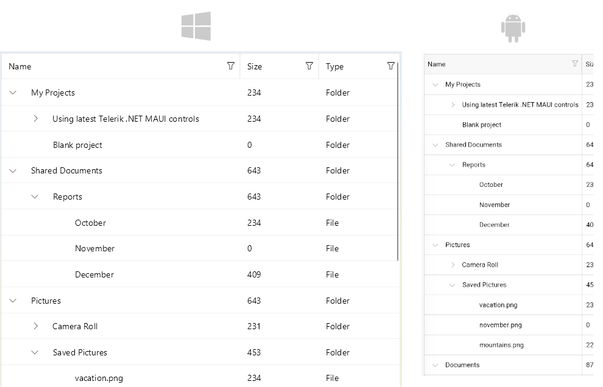

# Getting Started with the .NET MAUI TreeDataGrid

This guide provides the information you need to start using the [Telerik UI for .NET MAUI TreeDataGrid]() by adding the control to your project.

At the end, you will achieve the following result.



## Prerequisites

Before adding the TreeDataGrid, you need to:

1. [Set up your .NET MAUI application](#step-1-set-up-your-net-maui-application).

1. [Download Telerik UI for .NET MAUI](#step-2-download-telerik-ui-for-net-maui).

1. [Install Telerik UI for .NET MAUI](#step-3-install-telerik-ui-for-net-maui).

## Define the Control

The TreeDataGrid provides UI virtualization, so it requires its visual parent to provide vertical or horizontal space for the control to fit into. The following scenarios will measure the TreeDataGrid with infinite width and height constraints and the virtualization will not work:

* Positioning the TreeDataGrid inside a `StackLayout` which is wrapped in a `ScrollView`.
* Positioning the TreeDataGrid inside a `ScrollView` or controls with internal scrolling.

By default, the TreeDataGrid auto-generates rows depending on the number of objects in the collection set as its `ItemsSource`.

**1.** When your .NET MAUI application is set up, you are ready to add a TreeDataGrid control to your page.

<snippet id='treedatagrid-getting-started' />

**2.** Add the `telerik` namespace:

```XAML
xmlns:telerik="http://schemas.telerik.com/2022/xaml/maui"
```

**3.** Create a sample `Data` class:

<snippet id='treedatagrid-data-model' />

**4.** Add the `ViewModel` class:

<snippet id='treedatagrid-viewmodel' />

**5.** Register the Telerik controls through the `Telerik.Maui.Controls.Compatibility.UseTelerik` extension method called inside the `CreateMauiApp` method of the `MauiProgram.cs` file of your project:

```C#
using Telerik.Maui.Controls.Compatibility;

public static class MauiProgram
{
	public static MauiApp CreateMauiApp()
	{
		var builder = MauiApp.CreateBuilder();
		builder
			.UseTelerik()
			.UseMauiApp<App>()
			.ConfigureFonts(fonts =>
			{
				fonts.AddFont("OpenSans-Regular.ttf", "OpenSansRegular");
			});

		return builder.Build();
	}
}           
```

> For a runnable example with the TreeDataGrid Getting Started scenario, see the [SDKBrowser Demo Application]() and go to **TreeDataGrid > Getting Started** category. 

## Additional Resources

- [Setting the .NET MAUI TreeDataGrid Columns]()
- [Sorting .NET MAUI TreeDataGrid Records]()
- [Filtering .NET MAUI TreeDataGrid Records]()

## See Also

- [.NET MAUI TreeDataGrid Product Page](https://www.telerik.com/maui-ui/treedatagrid)
- [.NET MAUI TreeDataGrid Forum Page](https://www.telerik.com/forums/maui?tagId=1801)
- [Telerik .NET MAUI Blogs](https://www.telerik.com/blogs/mobile-net-maui)
- [Telerik .NET MAUI Roadmap](https://www.telerik.com/support/whats-new/maui-ui/roadmap)
