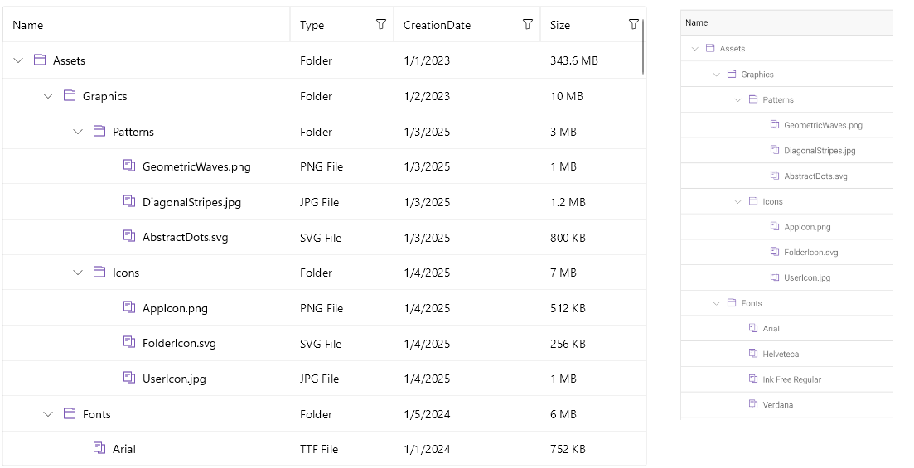

# .NET MAUI TreeDataGrid Overview

The Telerik UI for [.NET MAUI TreeDataGrid](https://www.telerik.com/maui-ui/treedatagrid) control presents hierarchical data with rows and columns. The TreeDataGrid inherits from the [DataGrid]() control and combines its powerful data-driven features with a tree-like structure.

When data from a database is sent to the client, it is usually converted to a business object (or the so-called `ViewModel`) where each instance represents a table row and each property of the object represents a column within the original table. The TreeDataGrid also supports alternating row colors so that your users can distinguish one row from another.

The optimized data layer of the TreeDataGrid enables fast sorting and filtering operations. The user interface uses virtualization for its row and cell elements, which means that visual elements are created only when needed and only for the currently visible cells.

## Data Binding

The TreeDataGrid control allows you to set the collection of custom business object as an `ItemsSource` in combination with a `TreeDataGridItemDescriptor` class to visualize the hierarchical structure.

## Built-in Columns

The MAUI TreeDataGrid provides a set of [built-in columns]() such as Text, Boolean, Numeric, ComboBox, Date, Time, and Template. These predefined templates allow you to handle different data types and user scenarios, each with its specific editor.

## Reorder and Resize Columns

The .NET MAUI TreeDataGrid provides a number of features and configuration options related to its columns to provide a flexible and usable user experience. For example, you can enable [column reordering]() and [resizing](). If you want to prevent a column from resizing, you can [lock the column]() and keep the important information always on top.

## Sort and Filter Data

Perform SORT and FILTER operations on your data by using the convenient API of the control. Apply the [sorting]() and [filtering]() operations per column.

## Editing

You can enable users to [edit]() the data presented in the .NET MAUI TreeDataGrid. Depending on the column data type, a relevant editor allows end users to edit content in a friendly environment. For example, if one of the columns is a date, a date-picker will be used to offer a change in the date field.

## Single and Multiple Selection

The TreeDataGrid features a [single or a multiple-item selection]() and provides options for controlling the cell or row selection unit, thus enabling any selection scenario you want your MAUI application users to have.

## Load Data On Demand

In some cases, you may need to [load data in the .NET MAUI TreeDataGrid when the control is already displayed]() as this can improve the performance of your application. The TreeDataGrid offers automatic data loading once the user scrolls to the last available record, or by displaying a customizable button which will initiate the loading of more data items.

## Row Details

The MAUI TreeDataGrid allows you to represent additional information for the data in the row by using the [row details]() feature.

## Search As You Type

The TreeDataGrid provides the ability to search for specific data within its `ItemsSource` by using its [built-in search functionality]().

## Paging Support

You can [page the data]() of the TreeDataGrid using the Telerik UI for .NET MAUI [DataPager]() control.

## Keyboard Navigation Support

Use keyboard keys for navigation in the MAUI TreeDataGrid control. This feature is available on WinUI and MacCatalyst.

## Row Height

By default, the row height is calculated according to the cell content. You can override this behavior by setting a [height for the rows](). 

## Column Footer

The Telerik UI for .NET MAUI TreeDataGrid allows you to display additional information which applies to the columns in a specific row placed at the bottom of the control. This row consists of individual [footer cells]() for each column.

## Empty Template

When the .NET MAUI TreeDataGrid does not have any data (`ItemsSource` is null or the collection is empty), an [empty template]() is displayed in the TreeDataGrid.

## Commands

The MAUI TreeDataGrid allows you to add [commands]() to the commands collection, in case you want to execute an additional logic when certain actions occur. You can execute the commands when cell is tapped, double tapped, begins the editing operation, when tapping on the column header, filter the data and more. 

## Theming and Style

You can apply a [theme]() to the MAUI TreeDataGrid. If you prefer to use your own styling, then you can use the flexible styling API of the .NET MAUI TreeDataGrid. The styling API allows you to style the TreeDataGrid rows and columns, the cell content inside the columns, the tree arrow appearance, etc.
In addition, you can apply a style selector.

## Localization

The Telerik UI for .NET MAUI TreeDataGrid provides [localization support](#localization). You can translate the text displayed in the Filtering UI, etc. to other languages, so that your application can be adapted to different cultures.

## Next Steps

- [Getting Started with Telerik UI for .NET MAUI TreeDataGrid]()

## See Also

- [.NET MAUI TreeDataGrid Product Page](https://www.telerik.com/maui-ui/treedatagrid)
- [.NET MAUI TreeDataGrid Forum Page](https://www.telerik.com/forums/maui?tagId=1801)
- [Telerik .NET MAUI Blogs](https://www.telerik.com/blogs/mobile-net-maui)
- [Telerik .NET MAUI Roadmap](https://www.telerik.com/support/whats-new/maui-ui/roadmap)
