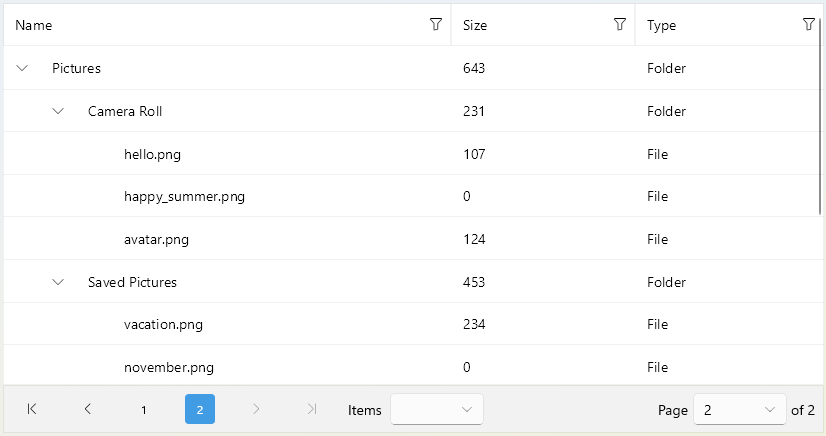

# .NET MAUI DataPager Integration with TreeDataGrid

You can page the data of the Telerik UI for .NET MAUI TreeDataGrid by using the [DataPager]() control.



>Currently, the DataPager does not support the TreeDataGrid `LoadOnDemand` collection.

## DataPager Features

Here is a list of the most important features of the DataPager control:

* [Binding to `IEnumerable`]()&mdash;You can bind the Pager to any collection that implements the `IEnumerable` interface.
* Setting different [Ellipsis modes]()&mdash;The ellipsis appears when the count of the page numbers is greater than the count of the numeric buttons.
* Setting different [Display modes]()&mdash;You can decide which of the visual elements in the DataPager will be visible.
* [Configuring the pages]() by using the following properties:
    * `PageIndex` (`int`)&mdash;Sets the current page.
    * `PageSize` (`int`)&mdash;Specifies the number of the items per page. The default value is `10`.
    * `PageSizes` (`IList<int>`)&mdash;Specifies a list with page sizes the end user can choose from. The default values in the list are `5, 10, 20, 50`.
    * `ItemsSpacing` (`double`)&mdash;Sets the spacing between the items in the pager.

* Customizing the appearance of the DataPager by styling its elements:
    * [DataPager]()
    * [NavigationView]()
    * [Navigation and Numeric Buttons]()
    * [PageSizes]()

## Example 

Here is an example of how to use the DataPager with the TreeDataGrid control.

**1.** Define the DataPager and the TreeDataGrid in XAML:

<snippet id='treedatagrid-datapager' />

**2.** Add the following namespace:

```XAML
xmlns:telerik="http://schemas.telerik.com/2022/xaml/maui"
```

**3.** Create a sample `Data` class:

<snippet id='treedatagrid-data-model' />

**4.** Add the `ViewModel` class:

<snippet id='treedatagrid-viewmodel' />

> For the DataPager Integration with TreeDataGrid example, go to the [SDKBrowser Demo Application]() and navigate to the **DataPager > Integration** category.

## See Also

- [Sorting .NET MAUI TreeDataGrid Records]()
