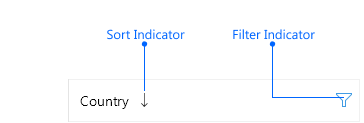
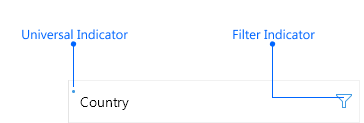

# .NET MAUI TreeDataGrid Columns Styling

The [Telerik UI for .NET MAUI TreeDataGrid]() component inherits the styling mechanism for customizing the look of the columns and their cells from the [DataGrid]() control.

The styling mechanism is represented by the following properties:

* `HeaderStyle` (`Style` with target type `DataGridColumnHeaderAppearance`)&mdash;Sets the style to the columns' headers.
* `FooterStyle` (`Style` with target type `DataGridColumnFooterAppearance`)&mdash;Defines the appearance of the column footer.
* `CellDecorationStyle` (`Style` with target type `DataGridCellDecorationAppearance`)&mdash;Defines the style of the border of each cell associated with the column.
* `CellContentStyle` (`Style` with target type depending on the column type)&mdash;Defines the appearance of each cell associated with the column.
* `CellEditorStyle` (`Style` with target type depending on the editor type)&mdash;Defines the style that will be applied to the cell editor.

## Header Style

`HeaderStyle` defines the appearance of the column header. The `HeaderStyle` is of type `Style` and targets the `DataGridColumnHeaderAppearance` class. The `DataGridColumnHeaderAppearance` exposes properties for styling its header and data operations indicators (filter indicator, sort indicator, or universal indicator).

To style the `DataGridColumnHeaderAppearance`, use the following properties:

* `TextColor` and `BackgroundColor`&mdash;Defines the colors of the text part/background respectively.
* `HoverBackgroundColor`&mdash;(Desktop-only) Defines the background color when the mouse is over the column header. 
* `BorderColor` and `BorderThickness`&mdash;Defines the style of the border around the column header.
* `Font Options` (`TextFontAttributes`, `TextFontFamily`, `TextFontSize`)&mdash;Defines the font options to the text part of the `ColumnHeader`.
* `Text Alignment` (`TextMargin`, `HorizontalTextAlignment`, `VerticalTextAlignment`)&mdash;Defines the positioning for the text part of the `ColumnHeader`.
* `TextHorizontalOptions` (`LayoutOptions`)&mdash;Defines the horizontal options of the text part of the header. 
* `TextVerticalOptions` (`LayoutOptions`)&mdash;Defines the vertical options of the text part of the header.

When you set the `TextHorizontalOptions` of the text part of the header, consider the current position of the sort indicator. Both elements are ordered in a defined way and modifying the position of any of them affects the other one.

For example, to position the column header text to `Center`, you have to set the `SortDescriptor` position to `Center` as well:

 ```XAML
<telerik:DataGridTextColumn.HeaderStyle>
	<Style TargetType="telerik:DataGridColumnHeaderAppearance">
		<Setter Property="TextHorizontalOptions" Value="Center" />
		<Setter Property="SortIndicatorHorizontalOptions" Value="Center" />
	</Style>
</telerik:DataGridTextColumn.HeaderStyle>
```

>tip For more details on how to hide the column headers from the TreeDataGrid visualization, review the following article: [How to Hide Column Headers in a DataGrid for MAUI]().

In addition to the column header text, the column header can contain the following indicators for sorting and filtering operations upon the DataGrid data: filter indicator, sort indicator, and universal indicator. Use the `RadTreeDataGrid`'s `DataOperationIndicationMode` property to define what indicators to appear in the columns' headers:

* `DataOperationIndicationMode` (`Telerik.Maui.Controls.DataGrid.DataOperationIndicationMode`)&mdash;Defines what indicators will be used in the columns' headers when sorting and filtering are applied. The valid options are:
	* `Individual`&mdash;(default) An individual indicator with a unique appearance will be used when a data operation is applied. If sorting is applied, a sort indicator will appear. If filtering is applied, the filter indicator takes its active color (the active color can be modified through the `DataGridColumnHeaderStyle`'s `FilterIndicatorActiveTextColor` property).

	>caption Individual indicators

    

    * `Universal`&mdash;A single indicator will be used when any data operation (filtering and sorting) is applied. If sorting is applied, the sort indicator won't be displayed, only the universal indicator. If filtering is applied, in addition to the universal indicator, the filter indicator takes its active color (the active color can be modified through the `DataGridColumnHeaderStyle`'s `FilterIndicatorActiveTextColor` property).

    >caption Universal indicators on Windows:

    

### Filter Indicator Styling

The `FilterIndicator` enables users to show the Filtering UI and filter the data. Style the `FilterIndicator` using the following properties:

* `FilterIndicatorTextColor`&mdash;Defines the color for the filter indicator part of the `ColumnHeader`.  
* `FilterIndicatorActiveTextColor`&mdash;Defines the color of the filter symbol when filtering is applied.
* `FilterIndicatorText`&mdash;Defines the text for the filter indicator part of the `ColumnHeader`. For the `FilterIndicatorText` to appear, set the `FilterIndicatorFontFamily` property.
* `FilterIndicatorMargin`&mdash;Defines the margin of the filter indicator part of the `ColumnHeader`.
* `Font Options`(`FilterIndicatorFontAttributes`, `FilterIndicatorFontFamily`, `FilterIndicatorFontSize`)&mdash;Define the font options to the filter indicator text. 

>note By default, the filter indicator is represented by a string symbol that can be changed by using the `FilterIndicatorText` and `FilterIndicatorFontFamily` properties. 

### Sort Indicator Styling

The `SortIndicator` appears once the column of the TreeDataGrid is sorted (when tapping or clicking on the `ColumnHeader` cell) and can be styled with the following properties:

* `SortIndicatorColor`&mdash;Defines the color for the sort indicator part of the `ColumnHeader`.  
* `SortIndicatorMargin`&mdash;Defines the margin of the sort indicator part of the `ColumnHeader`.
* `SortIndicatorAscendingText`&mdash;Defines the text of the sort indicator when the sorting is ascending.
* `SortIndicatorDescendingText`&mdash;Defines the text of the sort indicator when the sorting is descending.
* `SortIndicatorHorizontalOptions`&mdash;Defines the horizontal options of the sort indicator.

### Universal Indicator Styling

Style the universal indicator using the following properties:

* `IndicatorColor`&mdash;Defines the color for the universal indicator part of the `ColumnHeader`.
* `IndicatorText`&mdash;Defines the text for the universal indicator part of the `ColumnHeader`.  
* `IndicatorMargin`&mdash;Defines the margin of the universal indicator part of the `ColumnHeader`.
* `Font Options`(`IndicatorFontAttributes`, `IndicatorFontFamily`, `IndicatorFontSize`)&mdash;Define the font options to the universal indicator text. 

Check below a quick example of a TreeDataGrid with a `HeaderStyle`:

<snippet id='datagrid-columnstyle-headerstyle'/>

## Cell Content Styling

The `CellContentStyle` property defines the appearance of each cell associated with the column. `CellContentStyle` is of type `Style` which can target:

* The `DataGridTextCellAppearance` class for typed `DataGridColumns` (Text, Numerical, Boolean, Date, Time and ComboBox).
* The `DataGridToggleRowDetailsCellAppearance` class for the `DataGridToggleRowDetailsColumn`.

The `DataGridTextCellAppearance` class provides the following properties for styling the cell text:

* `Font` options (`FontAttributes`, `FontFamily`, `FontSize`)&mdash;Define the font of the cell text.
* `TextColor`/`SelectedTextColor`&mdash;Defines the color of the cells text. You can set a different value for the selected cell.
* `HoverTextColor`&mdash;Sets the color of the cells text when the mouse hovers over it. Applicable only on Desktop.
* `TextMargin`/ `HorizontalTextAlignment`/ `VerticalTextAlignment`&mdash;Defines the positioning of the text inside the cell.
* `SearchMatchTextColor`&mdash;Defines the color that is used for the parts of the text that are search matches.

>note The `CellContentStyle` does not apply for `TemplateColumn`. Also, the property is not applied to the built-in columns when they have a custom `CellContentTemplate`.

Here is an example how to set the `CellContentStyle` property to a `DataGridTextColumn`:

<snippet id='datagrid-columnstyle-cellcontent'/>

The `DataGridToggleRowDetailsCellAppearance` exposes the following properties for styling:

* `ButtonFontFamily`&mdash;Defines the font family for the toggle symbol.
* `ExpandButtonText`&mdash;Defines the text for the expanded state.
* `CollapseButtonText`&mdash;Defines the text for the collapsed state.
* `ButtonTextColor`&mdash;Defines the color for the toggle symbol.
* `SelectedButtonTextColor`&mdash;Defines the color for the toggle symbol when the item is selected.
* `HoverButtonTextColor`&mdash;Defines the color for the toggle symbol when the item is being hovered over.
* `ButtonFontSize`&mdash;Defines the font size for the toggle symbol.
* `ButtonFontAttributes`&mdash;Defines `Microsoft.Maui.Controls.FontAttributes` for the toggle symbol.
* `ButtonMargin` (`Thickness`)&mdash;Defines the margin for the toggle symbol.

## Cell Content Area Styling

To style the border of each cell associated with the column, use the `CellDecorationStyle` property. `CellDecorationStyle` is of type `Style` and targets the `DataGridCellDecorationAppearance` class. The `DataGridCellDecorationAppearance` provides the following properties&mdash;`BackgroundColor`, `BorderColor`, `BorderTickness`.

In addition, the `DataGridCellDecorationAppearance` provides the `SearchMatchBackgroundColor` property used to apply a separate background color to the border when the cell contains a search-match. 

Here is an example how to set those properties on a column:

<snippet id='datagrid-columnstyle-celldecoration'/>

## Cell Editor Styling 

`CellEditorStyle` defines the style that will be applied to the cell editor.

Here is an example how to set this property:

<snippet id='datagrid-columnstyle-celleditor'/>

>note The `CellEditorStyle` is not applied to the built-in columns when they have a custom `CellEditTemplate`.

## Footer Styling

`FooterStyle` defines the appearance of the column footer. The `FooterStyle` is of type `Style` and targets the `DataGridColumnFooterAppearance` class. The `DataGridColumnFooterAppearance` class provides the following styling properties:

* `TextColor` and `BackgroundColor`&mdash;Define the colors of the text part/background respectively.
* `BorderColor` and `BorderThickness`&mdash;Define the style of the border around the column footer.
* `Font Options` (`TextFontFamily`, `TextFontAttributes`, `TextFontSize`)&mdash;Define the font options to the text part of the `ColumnFooter`.
* `Text Alignment` (`TextMargin`, `HorizontalTextAlignment`, `VerticalTextAlignment`)&mdash;Define the positioning for the text part of the `ColumnFooter`.

<snippet id='datagrid-columnstyle-footerstyle' />

## See Also

- [TreeDataGrid Styling]()
- [Style Selectors]()
- [Search as You Type]()
