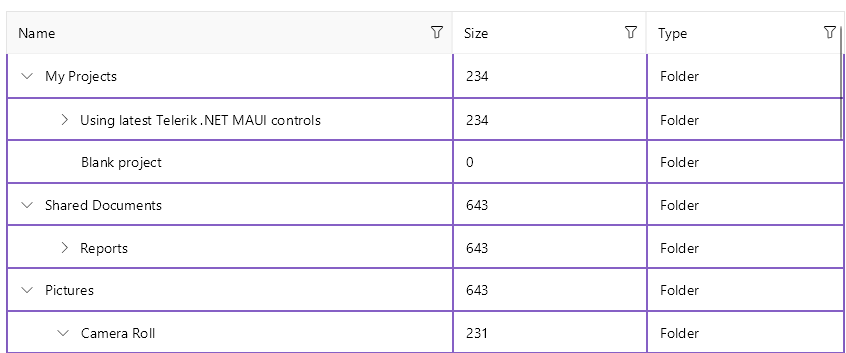

# .NET MAUI TreeDataGrid Styling

The [.NET MAUI TreeDataGrid]() control inherits all styling options provided by the DataGrid control. Also, you can modify the appearance of the expand and collapse indicator style.

## Style the Border Around the TreeDataGrid

You can configure the border around the TreeDataGrid control by using the following properties:

* `BorderBrush`&mdash;Defines the brush of the border placed around the TreeDataGrid control.
* `BorderThickness`&mdash;Defines the thickness of the border around the TreeDataGrid control.

The following snippet shows how to set the `BorderBrush` and `BorderThickness` properties of the TreeDataGrid control:

```XAML
<Style TargetType="telerik:RadTreeDataGrid">
	<Setter Property="BorderBrush" Value="#8660C5" />
	<Setter Property="BorderThickness" Value="2" />
</Style>
```

The next image shows the end result.


## Style the TreeDataGrid Cells and Rows

You can style the rows and cells of the TreeDataGrid with the following properties:

* `RowBackgroundStyle`(of type `Style` with target type `DataGridRowBackgroundAppearance`)&mdash;Defines the style of each row.
* `AlternateRowBackgroundStyle`(of type `Style` with target type `DataGridRowBackgroundAppearance`)&mdash;Defines the appearance style of an alternated row.
* `SelectionStyle`(of type `Style` with target type `DataGridSelectionAppearance`)&mdash;Defines the appearance settings applied to the selected DataGrid row.
* `CurrentCellStyle`(of type `Style` with target type `DataGridCurrentCellAppearance`)&mdash;Defines the style applied to the current cell.
* (Desktop-only)`MouseHoverStyle`(of type `Style` with target type `DataGridMouseHoverAppearance`)&mdash;Specifies the style applied to the cells and rows when the mouse is over them.

The target types of the `RowBackgroundStyle`, `AlternateRowBackgroundStyle`, `SelectionStyle`, `CurrentCellStyle`, and `MouseHoverStyle` styling properties derive from the `DataGridBorderAppearance` class. The `DataGridBorderAppearance` exposes the following properties:
* `SearchMatchBackgroundColor` (`Color`)&mdash;Specifies the color that fills the area within the border when the cell contains a search-match.
* `BackgroundColor` (`Color`)&mdash;Specifies the color that fills the area within the border.
* `BorderColor` (`Color`)&mdash;Specifies the border color.
* `BorderThickness` (`Thickness`)&mdash;Specifies the thickness of the border.

For styling the `CurrentCell` by using the `CurrentCellStyle` property, review the [Cells](#styling-the-cell) article.

## Style the Expand/Collapse Indicator

You can style the expand/collapse indicator by using the `ExpandCollapseIndicatorStyle` (`Style` with target type `TreeDataGridExpandCollapseIndicatorAppearance`) property. The `TreeDataGridExpandCollapseIndicatorAppearance` class exposes the following properties:

* `ExpandText`&mdash;Specifies the text for the expand indicator of the item.
* `CollapseText`&mdash;Specifies the text for the collapse indicator of the item.
* `TextColor`&mdash;Specifies the color of the expand/collapse symbol.
* `Font Options`&mdash;Specify the `FontSize`, `FontAttributes`, and `FontFamily`.
* `Margin`&mdash;Specifies the margin for the expand/collapse symbol of the item.
* `BackgroundColor` (`Color`)&mdash;Specifies the color that fills the area within the border.
* `BorderColor` (`Color`)&mdash;.Specifies the border color.
* `BorderThickness` (`Thickness`)&mdash;Specifies the thickness of the border.

You can set the `GridLinesVisibility` property in the following way:

```XAML
<telerik:RadTreeDataGrid>
	<telerik:RadTreeDataGrid.ExpandCollapseIndicatorStyle>
		<Style TargetType="telerik:TreeDataGridExpandCollapseIndicatorAppearance">
			<Setter Property="TextColor" Value="Purple" />
		</Style>
	</telerik:RadTreeDataGrid.ExpandCollapseIndicatorStyle>
</telerik:RadTreeDataGrid>
```

The next image shows the end result.


## Configure and Style the Horizontal and Vertical Grid Lines

Use the following properties for configuring the TreeDataGrid grid lines:

* `GridLinesVisibility`(`Telerik.Maui.Controls.DataGrid.GridLinesVisibility`)&mdash;Defines which DataGrid lines are currently visible (displayed). The property accepts the `Both`, `Horizontal`, `None`, and `Vertical` values.
* `GridLinesColor`&mdash;Defines the appearance of the horizontal and vertical DataGrid lines.
* `GridLinesThickness`&mdash;Defines the width of the vertical and the height of the horizontal DataGrid lines.

You can set the `GridLinesVisibility` property in the following way:

```XAML
<telerik:RadTreeDataGrid ItemsSource="{Binding Items}"
						 GridLinesVisibility="Both" 
						 GridLinesColor="#8660C5"
						 GridLinesThickness="2"
						 AutoGenerateColumns="False">
	<telerik:RsadTreeDataGrid.ItemDescriptor>
		<telerik:TreeDataGridItemDescriptor ItemsSourceBinding="{Binding Children}" />
	</telerik:RadTreeDataGrid.ItemDescriptor>
	<telerik:RadTreeDataGrid.Columns>
		<telerik:DataGridTextColumn PropertyName="Name" />
		<telerik:DataGridNumericalColumn PropertyName="Size" />
		<telerik:DataGridTextColumn PropertyName="Type" />
	</telerik:RadTreeDataGrid.Columns>
</telerik:RadTreeDataGrid>
```

The next image shows the end result.



## Style the Splitter UI

The TreeDataGrid provides the `FrozenColumnsSplitterStyle` (of type `Style` with target type `DataGridFrozenColumnsSplitterAppearance`) property which allows you to style the UI of the splitter dividing the frozen (locked) from the unfrozen (unlocked) columns.

To style the appearance of the splitter, which appears when the user freezes (locks) the columns in the TreeDataGrid, use the `Width`, `BackgroundColor`, `BorderColor`, and `BorderThickness` properties.

```XAML
<telerik:RadTreeDataGrid>
	<telerik:RadTreeDataGrid.FrozenColumnsSplitterStyle>
		<Style TargetType="telerik:DataGridFrozenColumnsSplitterAppearance">
			<Setter Property="Width" Value="5" />
			<Setter Property="BorderColor" Value="Gray" />
			<Setter Property="BorderThickness" Value="2" />
			<Setter Property="BackgroundColor" Value="LightBlue" />
		</Style>
	</telerik:RadTreeDataGrid.FrozenColumnsSplitterStyle>
</telerik:RadTreeDataGrid>
```

The next image shows the end result.


## See Also

- [Styling the .NET MAUI TreeDataGrid Columns]()
- [Available DataGrid Style Selectors]()
