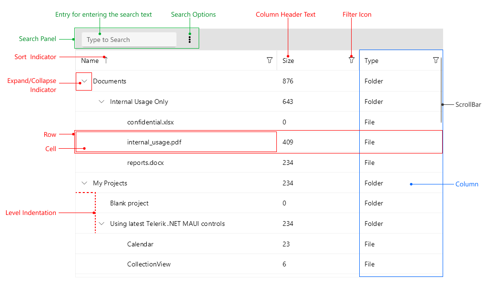

# .NET MAUI TreeDataGrid Visual Structure

The visual structure of the .NET MAUI TreeDataGrid represents the anatomy of the UI control. Being familiar with the visual elements of the TreeDataGrid allows you to quickly find the information required to configure them.

The following image shows the anatomy of the TreeDataGrid.

## Displayed Elements

- **Search Panel**&mdash;Represents the area with all search related elements as follow:
	- **Entry for entering the search text**&mdash;Represents an entry control where the end user can enter the search term.
	- **Search Options** to choose from, such as whether to match the case, or whether to filter the results.
- **Filter Icons**&mdash;Represents an icon that allows opening the filtering UI.
- **Sort Indicator**&mdash;Represents an icon which displays when tapping on the column header and sorting is enabled. The icon direction points whether the order of the sorting is ascending or descending.
- **Row**&mdash;Represents the row of the TreeDataGrid.
- **Cell**&mdash;Represents the cell of the TreeDataGrid.
- **Group Header**&mdash;Represents the elements inside the group area&mdash;the group header and group expand or collapse indicator.
- **Expand/Collapse Indicator**&mdash;Represents the expand/collapse indicator. The presence of such an indicator indicates whether the item has children.
- **Level Indentation**&mdash;Represents hierarchical data.
- **Column**&mdash;Represents the column in the TreeDataGrid.
- **Column Header Text**&mdash;Represents the header text in the column.
- **ScrollBar**&mdash;Represents the ScrollBar.