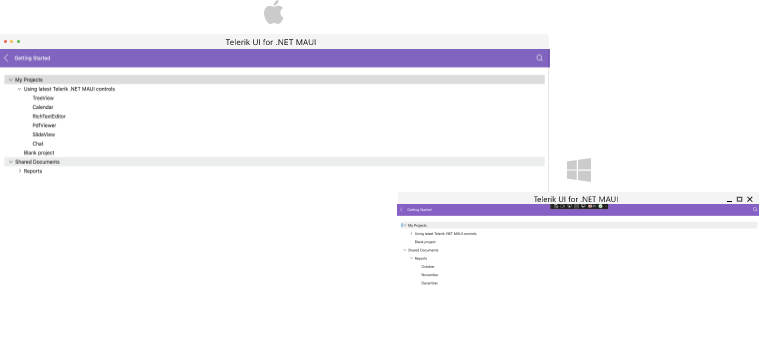
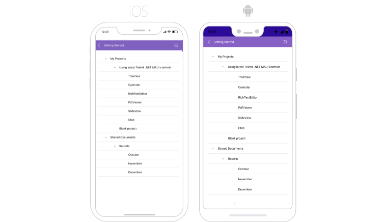

# Getting Started with the .NET MAUI TreeView

This guide provides the information you need to start using the Telerik UI for .NET MAUI TreeView by adding the control to your project.

At the end, you will be able to achieve the result on the first image on desktop platforms and the results on the second image on mobile platforms:






## Prerequisites

Before adding the TreeView, you need to:

1. [Set up your .NET MAUI application](#step-1-set-up-your-net-maui-application).

1. [Download Telerik UI for .NET MAUI](#step-2-download-telerik-ui-for-net-maui).

1. [Install Telerik UI for .NET MAUI](#step-3-install-telerik-ui-for-net-maui).

## Define the Control

When your .NET MAUI application is setup, you are ready to add a TreeView control to your page. The following example shows a sample TreeView definition populated with sample data.

The TreeView provides UI virtualization, which requires the visual parent to provide vertical or horizontal space. To avoid breaking UI virtualization or gesture mechanisms:

* Do not place the TreeView inside a `StackLayout` or inside a `ScrollView`.
* Do not set the TreeView to a `RowDefinition Height="Auto"` Grid definition.

**1.** Set up the `RadTreeView` instance:

<snippet id='treeview-getting-started-xaml' />

**2.** Add the `telerik` namespaces:

```XAML
xmlns:telerik="http://schemas.telerik.com/2022/xaml/maui"
```

**3.** Create a sample `Item` class:

<snippet id='treeview-getting-started-item' />

**4.** Add the `ViewModel` class:

<snippet id='treeview-getting-started-viewmodel' />

**5.** Register the Telerik controls through the `Telerik.Maui.Controls.Compatibility.UseTelerik` extension method called inside the `CreateMauiApp` method of the `MauiProgram.cs` file of your project:

```C#
using Telerik.Maui.Controls.Compatibility;

public static class MauiProgram
{
	public static MauiApp CreateMauiApp()
	{
		var builder = MauiApp.CreateBuilder();
		builder
			.UseTelerik()
			.UseMauiApp<App>()
			.ConfigureFonts(fonts =>
			{
				fonts.AddFont("OpenSans-Regular.ttf", "OpenSansRegular");
			});

		return builder.Build();
	}
}           
```

> For a runnable example with the TreeView Getting Started scenario, see the [SDKBrowser Demo Application]() and go to **TreeView > Getting Started**.

## Additional Resources

* [Expand and Collapse TreeView Items]()
* [CheckBoxes in TreeView]()
* [Styling the TreeView Item]()
* [Scrolling options]()
* [Multiple and Single Selection]()
* [Events]()
* [Available Commands in .NET MAUI TreeView]()

## See Also

- [.NET MAUI TreeView Product Page](https://www.telerik.com/maui-ui/treeview)
- [.NET MAUI TreeView Forum Page](https://www.telerik.com/forums/maui?tagId=2056)
- [Telerik .NET MAUI Blogs](https://www.telerik.com/blogs/mobile-net-maui)
- [Telerik .NET MAUI Roadmap](https://www.telerik.com/support/whats-new/maui-ui/roadmap)
