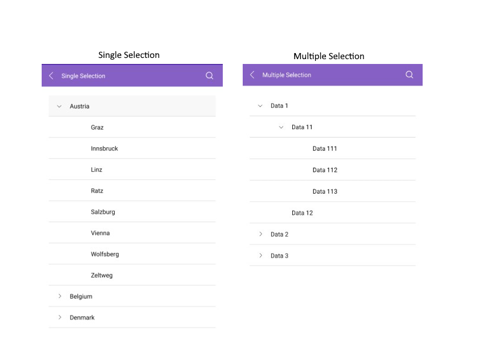

# Selection

The TreeView for .NET MAUI exposes selection feature. It allows single or multiple selection of the ListView items. This feature provides both visual and programmatic feedback for the actions of the user. Also you can disable the selection.

## Selection Mode

The TreeView provides three selection modes, which allow you to manipulate the type of selection. This is controlled by the `SelectionMode` (`Microsoft.Maui.Controls.SelectionMode`) property which has the following entries:

- `None`&mdash;This mode doesn't allow users to select an item.
- `Single`&mdash;This is the default selection mode. It allows users to select only one item.
- `Multiple`&mdash;This mode allows users to select more than one item.

## Setting the selected item

The TreeView provides the `SelectedItem` (`object`) property, which specifies the last selected item of the ListView.

>important For the Treeview Selected Item example refer to the [SDKBrowser Demo Application]() TreeView -> Selection category.

## Selected Items Collection

The TreeView provides the `SelectedItems` collection of type`IList`. The collection contains the items that are currently selected in the control.

>important For the Treeview Selected Items example refer to the [SDKBrowser Demo Application]() TreeView -> Selection category.

## Selection Events

The Treeview provides the `SelectionChanged` event, which is raised when the current selection changes. The `SelectionChanged` event handler receives two parameters:

* The sender argument which is of type object, but can be cast to the `RadTreeView` type.
* A `EventArgs` object which provides information on the collection changed event.

>important For the Treeview Selection event refer to the [SDKBrowser Demo Application]() TreeView -> Events category.

## See Also

* [Expand/Collapse]()
* [CheckBoxes]()
* [Styling]()
* [Scrolling]()
* [Events]()
* [Commands]()