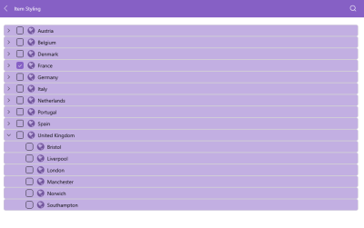

# Styling the TreeView

The TreeView for .NET MAUI allows you to easily style its checkboxes, expand indicator, and items by using the provided properties.

To style the TreeView, use the following properties:

* `BackgroundColor`(`Color`)&mdash;Specifies the background color of the control.
* `BorderColor`(`Color`)&mdash;Specifies the border color of the control.
* `BorderBrush`(`Color`)&mdash;Specifies the border brush of the control.
* `BorderThickness`(`Thickness`)&mdash;Specifies the border thickness of the control.
* `CornerRadius`(`Thickness`)&mdash;Specifies the corner radius of the control.
* `ContentPadding`(`Thickness`)&mdash;Specifies the content padding of the control.

## Styling and Configuring the TreeView Item

The TreeView provides a styling mechanism for customizing the look of its items.
To utilize it, set the `ItemStyle` property of the control with target type `TreeViewItemView`.

The available properties are:

* `IsExpanded`(`bool`)&mdash;Defines a value indicating whether the tree item is expanded.
* `IsChecked`(`bool?`)&mdash;Defines a value indicating whether the tree item is checked.
* `ImageSource`(`ImageSource`)&mdash;Defines the source of the image to display in the tree item.
* `IsImageVisible`(`bool`)&mdash;Defines a value indicating whether the image is visible.
* `IsExpandButtonVisible`(`bool`)&mdash;Defines a value indicating whether the expand button is visible.
* `BackgroundColor`(`Color`)&mdash;Defines the spacing in pixels between the elements of the tree item.
* `BorderBrush`(`Brush`)&mdash;Defines the spacing in pixels between the elements of the tree item.
* `BorderThickness`(`Thickness`)&mdash;Defines the spacing in pixels between the elements of the tree item.
* `TextColor`(`Color`)&mdash;Defines the spacing in pixels between the elements of the tree item.

The following example demonstrates how to style the TreeView item:

**1.** Define the style in the resources of the page: 

<snippet id='treeview-item-styling'/>

**2.** Set the style to the `RadTreeView`:

<snippet id='treeview-styling'/>

**3.** Add the location data model:

<snippet id='treeview-location-model'/>

**4.** Add the country data model:

<snippet id='treeview-country-model'/>

**5.** Add the city data model:

<snippet id='treeview-city-model'/>

**6.** Add the the ViewModel:

<snippet id='treeview-location-viewmodel'/>

## Styling the Expand Button

To style the expand button, which is used for expanding or collapsing the TreeView item, use the `TreeViewItemExpandButton`. It inherits from the `TreeViewItemButton`. The control used for the button is the .NET MAUI `RadButton` control. All stying properties available for [`RadButton`]() can be applied to `TreeViewItemExpandButton`.

<snippet id='treeview-expand-styling'/>

## Styling the Image

To style the image in the TreeView item, use the `TreeViewItemImage`. The control used for this image is the .NET MAUI `Image` control.

<snippet id='treeview-image-styling'/>

## Style the Checkbox

To style the checkbox element in the TreeView, use the `TreeViewItemCheckBox`. The control used for the checkbox elements is the [Telerik `RadCheckBox` control](). You can use all styling properties provided by the `RadCheckBox` to style the checkbox elements in the TreeView.

<snippet id='treeview-item-checkbox-styling'/>

> For a runnable example demonstrating the TreeView item's style, see the [SDKBrowser Demo Application]() and go to **TreeView > Styling**.

## See Also

* [Expand/Collapse]()
* [CheckBoxes]()
* [Scrolling]()
* [Selection]()
* [Events]()
* [Commands]()