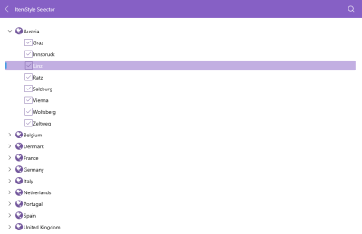

# Style Selector on Items

The TreeView exposes conditional styling feature. It allows users to apply a different Style to each item depending on a specific condition.

**Example**

The `ItemStyleSelector` property set to the RaDTreeView:

<snippet id='treeview-item-styleselector'/>

The Style Selector defined in XAML:

<snippet id='treeview-style-selector'/>

The custom class `LocationStyleSelector` that inherits from `IStyleSelector`:

<snippet id='treeview-styleselector'/>

Set the style to the `RadTreeView`:

<snippet id='treeview-styling'/>

The Location data model:

<snippet id='treeview-location-model'/>

The Country data model:

<snippet id='treeview-country-model'/>

The City data model:

<snippet id='treeview-city-model'/>

The ViewModel:

<snippet id='treeview-location-viewmodel'/>

>important For the Treeview ItemStyle Selector example refer to the [SDKBrowser Demo Application]() TreeView -> Styling category

## See Also

* [Expand/Collapse]()
* [CheckBoxes]()
* [Styling]()
* [Scrolling]()
* [Selection]()
* [Events]()
* [Commands]()