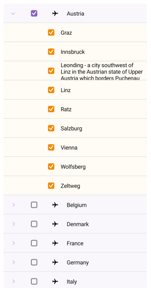

# .NET MAUI TreeView ScrollBar Styling

The TreeView for .NET MAUI allows you to style its vertical and horizontal scrollbar.

## See Also

* [Expand and Collapse TreeView Items]()
* [CheckBoxes in TreeView]()
* [Styling the TreeView Item]()
* [Scrolling options]()
* [Multiple and Single Selection]()
* [Events]()
* [Available Commands in .NET MAUI TreeView]()