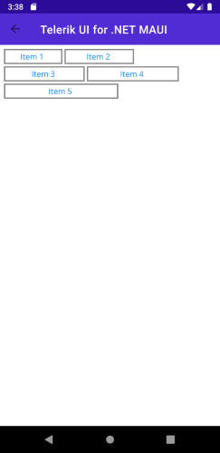

# Getting Started with the .NET MAUI WrapLayout

This guide provides the information you need to start using the Telerik UI for .NET MAUI WrapLayout by adding the control to your project.

At the end, you will achieve the following result.



## Prerequisites

Before adding the WrapLayout, you need to:

1. [Set up your .NET MAUI application](#step-1-set-up-your-net-maui-application).

1. [Download Telerik UI for .NET MAUI](#step-2-download-telerik-ui-for-net-maui).

1. [Install Telerik UI for .NET MAUI](#step-3-install-telerik-ui-for-net-maui).

## Define the Control

1. When your .NET MAUI application is set up, you are ready to add a WrapLayout control to your page.

 <snippet id='wraplayout-getting-started-xaml' />

 1. The resources for `RadBorder` applied in the Page's Resource:
 
 <snippet id='wraplayout-getting-started-xaml-resources' />


1. Add the following namespace:

 ```XAML
xmlns:telerik="http://schemas.telerik.com/2022/xaml/maui" 
 ```

1. Register the Telerik controls through the `Telerik.Maui.Controls.Compatibility.UseTelerik` extension method called inside the `CreateMauiApp` method of the `MauiProgram.cs` file of your project:

 ```C#
 using Telerik.Maui.Controls.Compatibility;

 public static class MauiProgram
 {
	public static MauiApp CreateMauiApp()
	{
		var builder = MauiApp.CreateBuilder();
		builder
			.UseTelerik()
			.UseMauiApp<App>()
			.ConfigureFonts(fonts =>
			{
				fonts.AddFont("OpenSans-Regular.ttf", "OpenSansRegular");
			});

		return builder.Build();
	}
 }           
 ```
 
## Additional Resources

- [.NET MAUI WrapLayout Product Page](https://www.telerik.com/maui-ui/wraplayout)
- [.NET MAUI WrapLayout Forum Page](https://www.telerik.com/forums/maui?tagId=1831)
- [Telerik .NET MAUI Blogs](https://www.telerik.com/blogs/mobile-net-maui)
- [Telerik .NET MAUI Roadmap](https://www.telerik.com/support/whats-new/maui-ui/roadmap)

## See Also

- [Wrap Functionality]()
