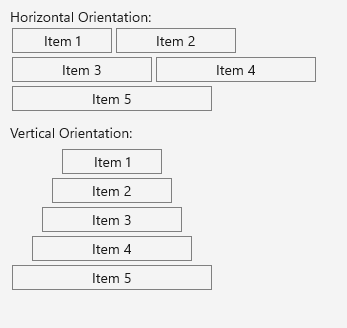

# Wrap Functionality

The WrapLayout is a layout container that lets you position items in rows or columns based on the `Orientation` property. When the space is filled, the container automatically wraps items onto a new row or column.

## Orientation

The WrapLayout exposes the `Orientation` property, which specifies whether the child items will be wrapped in rows (horizontal orientation) or in columns (vertical orientation). By default, the WrapLayout wraps its items horizontally.

The following example demonstrates how to set both the `"Horizontal"` and `"Vertical"` orientation:

```XAML
<VerticalStackLayout VerticalOptions="StartAndExpand" Margin="0,0,0,5">
	<Label Text="Horizontal Orientation:"/>
	<telerik:RadWrapLayout Orientation="Horizontal">
		<telerik:RadBorder BorderColor="Gray" BorderThickness="2" Margin="2" WidthRequest="100">
			<Label Text="Item 1" HorizontalOptions="Center" Margin="2"/>
		</telerik:RadBorder>
		<telerik:RadBorder BorderColor="Gray" BorderThickness="2" Margin="2" WidthRequest="120">
			<Label Text="Item 2" HorizontalOptions="Center" Margin="2"/>
		</telerik:RadBorder>
		<telerik:RadBorder BorderColor="Gray" BorderThickness="2" Margin="2" WidthRequest="140">
			<Label Text="Item 3" HorizontalOptions="Center" Margin="2"/>
		</telerik:RadBorder>
		<telerik:RadBorder BorderColor="Gray" BorderThickness="2" Margin="2" WidthRequest="160">
			<Label Text="Item 4" HorizontalOptions="Center" Margin="2"/>
		</telerik:RadBorder>
		<telerik:RadBorder BorderColor="Gray" BorderThickness="2" Margin="2" WidthRequest="200">
			<Label Text="Item 5" HorizontalOptions="Center" Margin="2"/>
		</telerik:RadBorder>
	</telerik:RadWrapLayout>

	<Label Text="Vertical Orientation:" Margin="0,10,0,5"/>
	<telerik:RadWrapLayout Orientation="Vertical">
		<telerik:RadBorder BorderColor="Gray" BorderThickness="2" Margin="2" WidthRequest="100">
			<Label Text="Item 1" HorizontalOptions="Center" Margin="2"/>
		</telerik:RadBorder>
		<telerik:RadBorder BorderColor="Gray" BorderThickness="2" Margin="2" WidthRequest="120">
			<Label Text="Item 2" HorizontalOptions="Center" Margin="2"/>
		</telerik:RadBorder>
		<telerik:RadBorder BorderColor="Gray" BorderThickness="2" Margin="2" WidthRequest="140">
			<Label Text="Item 3" HorizontalOptions="Center" Margin="2"/>
		</telerik:RadBorder>
		<telerik:RadBorder BorderColor="Gray" BorderThickness="2" Margin="2" WidthRequest="160">
			<Label Text="Item 4" HorizontalOptions="Center" Margin="2"/>
		</telerik:RadBorder>
		<telerik:RadBorder BorderColor="Gray" BorderThickness="2" Margin="2" WidthRequest="200">
			<Label Text="Item 5" HorizontalOptions="Center" Margin="2"/>
		</telerik:RadBorder>
	</telerik:RadWrapLayout>
</VerticalStackLayout>
```

In the example, `telerik` is defined like this:

```XAML
xmlns:telerik="clr-namespace:Telerik.Maui.Controls;assembly=Telerik.Maui.Controls"
```


The following image shows the end result on different platforms:



## Item Size

The WrapLayout exposes the `ItemWidth` and `ItemHeight` properties, which define the layout area for each child element. By default, the available size for the items is not restricted.

Here is a quick sample of a WrapLayout with a specified item size:

```XAML
<telerik:RadWrapLayout x:Name="wrapLayout" ItemHeight="50" ItemWidth="150" Margin="0,20,0,0">
	<telerikInput:RadButton BorderThickness="1" Text="Item 1" Margin="2"/>
	<telerikInput:RadButton BorderThickness="1" Text="Item 2" Margin="2"/>
	<telerikInput:RadButton BorderThickness="1" Text="Item 3" Margin="2"/>
</telerik:RadWrapLayout>
```


The following image shows the end result.


## Positioning the Last Child Element

The WrapLayout exposes the `StretchLastChild` property, which enables you to control the position and layout of the last child item from the layout items collection. If set to `True`, the last element will stretch along the remaining space from the last row or column depending on the layout orientation.

The following example shows how `StretchLastChild` will work when set to both values:

<snippet id='wraplayout-position-lastelement'/>
```XAML
<StackLayout Orientation="Vertical" VerticalOptions="Start">
	<Label Text="StretchLastChild = True" Margin="0,0,0,5"/>
	<telerik:RadWrapLayout StretchLastChild="True">
		<telerikInput:RadButton BorderThickness="1" Text="First Child" Margin="2"/>
		<telerikInput:RadButton BorderThickness="1" Text="Last Child" Margin="2"/>
	</telerik:RadWrapLayout>

	<Label Text="StretchLastChild = False" Margin="0,10,0,5"/>
	<telerik:RadWrapLayout StretchLastChild="False">
		<telerikInput:RadButton BorderThickness="1" Text="First Child" Margin="2"/>
		<telerikInput:RadButton BorderThickness="1" Text="Last Child" Margin="2"/>
	</telerik:RadWrapLayout>
</StackLayout>
```


The following image shows the end result.


## See Also

- [Getting Started with Telerik UI for .NET MAUI WrapLayout]()
