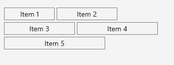

# Getting Started

This guide provides the information you need to start using the Telerik UI for .NET MAUI Barcode by adding the control to your project.

At the end, you will be able to achieve the following result.



## Prerequisites

Before adding the WrapLayout, you need to:

1. [Set up your .NET MAUI application](#set-up-your-net-maui-application).

1. [Download Telerik UI for .NET MAUI](#download-telerik-ui-for-net-maui).

1. [Install Telerik UI for .NET MAUI](#install-telerik-ui-for-net-maui).

## Define the Control

1. When your .NET MAUI application is set up, you are ready to add a WrapLayout control to your page.

 ```XAML
<telerik:RadWrapLayout Orientation="Horizontal">
	<telerik:RadBorder BorderColor="Gray" BorderThickness="2" Margin="2" WidthRequest="100">
		<Label Text="Item 1" HorizontalOptions="Center" Margin="2"/>
	</telerik:RadBorder>
	<telerik:RadBorder BorderColor="Gray" BorderThickness="2" Margin="2" WidthRequest="120">
		<Label Text="Item 2" HorizontalOptions="Center" Margin="2"/>
	</telerik:RadBorder>
	<telerik:RadBorder BorderColor="Gray" BorderThickness="2" Margin="2" WidthRequest="140">
		<Label Text="Item 3" HorizontalOptions="Center" Margin="2"/>
	</telerik:RadBorder>
	<telerik:RadBorder BorderColor="Gray" BorderThickness="2" Margin="2" WidthRequest="160">
		<Label Text="Item 4" HorizontalOptions="Center" Margin="2"/>
	</telerik:RadBorder>
	<telerik:RadBorder BorderColor="Gray" BorderThickness="2" Margin="2" WidthRequest="200">
		<Label Text="Item 5" HorizontalOptions="Center" Margin="2"/>
	</telerik:RadBorder>
</telerik:RadWrapLayout>
 ```

1. Add the following namespace:

 ```XAML
xmlns:telerik="clr-namespace:Telerik.Maui.Controls;assembly=Telerik.Maui.Controls"
 ```

1. Register the Telerik controls through the `Telerik.Maui.Controls.Compatibility.UseTelerik` extension method called inside the `Configure` method of the `Startup.cs` file of your project:

 ```C#
using Telerik.Maui.Controls.Compatibility;

public void Configure(IAppHostBuilder appBuilder)
{
	appBuilder		
		.UseTelerik()
		.UseMauiApp<App>();

}              
 ```

## See Also

- [Wrap Functionality]()
