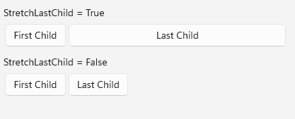

# Wrap functionality

RadWrapLayout is a layout container that lets you position items in rows or columns, based on the `Orientation` property. When the space is filled, the container automatically wraps items onto a new row or column.

## Wrap Orientation

WrapLayout exposes `Orientation` property which specifies whether the child items will be wrapped in rows - Horizontal orientation or in columns - Vertical orientation. By default WrapLayout wraps items horizontally.

Check a quick example below with both "Horizontal" and "Vertical" Orientation:

```XAML
<VerticalStackLayout VerticalOptions="StartAndExpand" Margin="0,0,0,5">
	<Label Text="Horizontal Orientation:"/>
	<telerik:RadWrapLayout Orientation="Horizontal">
		<telerik:RadBorder BorderColor="Gray" BorderThickness="2" Margin="2" WidthRequest="100">
			<Label Text="Item 1" HorizontalOptions="Center" Margin="2"/>
		</telerik:RadBorder>
		<telerik:RadBorder BorderColor="Gray" BorderThickness="2" Margin="2" WidthRequest="120">
			<Label Text="Item 2" HorizontalOptions="Center" Margin="2"/>
		</telerik:RadBorder>
		<telerik:RadBorder BorderColor="Gray" BorderThickness="2" Margin="2" WidthRequest="140">
			<Label Text="Item 3" HorizontalOptions="Center" Margin="2"/>
		</telerik:RadBorder>
		<telerik:RadBorder BorderColor="Gray" BorderThickness="2" Margin="2" WidthRequest="160">
			<Label Text="Item 4" HorizontalOptions="Center" Margin="2"/>
		</telerik:RadBorder>
		<telerik:RadBorder BorderColor="Gray" BorderThickness="2" Margin="2" WidthRequest="200">
			<Label Text="Item 5" HorizontalOptions="Center" Margin="2"/>
		</telerik:RadBorder>
	</telerik:RadWrapLayout>

	<Label Text="Vertical Orientation:" Margin="0,10,0,5"/>
	<telerik:RadWrapLayout Orientation="Vertical">
		<telerik:RadBorder BorderColor="Gray" BorderThickness="2" Margin="2" WidthRequest="100">
			<Label Text="Item 1" HorizontalOptions="Center" Margin="2"/>
		</telerik:RadBorder>
		<telerik:RadBorder BorderColor="Gray" BorderThickness="2" Margin="2" WidthRequest="120">
			<Label Text="Item 2" HorizontalOptions="Center" Margin="2"/>
		</telerik:RadBorder>
		<telerik:RadBorder BorderColor="Gray" BorderThickness="2" Margin="2" WidthRequest="140">
			<Label Text="Item 3" HorizontalOptions="Center" Margin="2"/>
		</telerik:RadBorder>
		<telerik:RadBorder BorderColor="Gray" BorderThickness="2" Margin="2" WidthRequest="160">
			<Label Text="Item 4" HorizontalOptions="Center" Margin="2"/>
		</telerik:RadBorder>
		<telerik:RadBorder BorderColor="Gray" BorderThickness="2" Margin="2" WidthRequest="200">
			<Label Text="Item 5" HorizontalOptions="Center" Margin="2"/>
		</telerik:RadBorder>
	</telerik:RadWrapLayout>
</VerticalStackLayout>
```

where *telerik* is defined like this:

```XAML
xmlns:telerik="clr-namespace:Telerik.Maui.Controls;assembly=Telerik.Maui.Controls"
```

Check the result on different platforms below:


## Item Size

WrapLayout exposes `ItemWidth` and `ItemHeight` properties which define the layout area for each child element. By default the available size for the items is not restricted.

Here is a quick sample of RadWrapLayout with specified item size:

```XAML
<telerik:RadWrapLayout x:Name="wrapLayout" ItemHeight="50" ItemWidth="150" Margin="0,20,0,0">
	<telerikInput:RadButton BorderThickness="1" Text="Item 1" Margin="2"/>
	<telerikInput:RadButton BorderThickness="1" Text="Item 2" Margin="2"/>
	<telerikInput:RadButton BorderThickness="1" Text="Item 3" Margin="2"/>
</telerik:RadWrapLayout>
```

And the result is:


## Configure last child element position

By default, the last element inside the WrapLayout stretches along the remaining space not occupied by the other child elements. You can prevent this behavior by setting `StretchLastChild` property of the WrapLayout control to *False*. Check the example below how it would work when set to both values:

<snippet id='wraplayout-position-lastelement'/>
```XAML
<StackLayout Orientation="Vertical" VerticalOptions="Start">
	<Label Text="StretchLastChild = True" Margin="0,0,0,5"/>
	<telerik:RadWrapLayout StretchLastChild="True">
		<telerikInput:RadButton BorderThickness="1" Text="First Child" Margin="2"/>
		<telerikInput:RadButton BorderThickness="1" Text="Last Child" Margin="2"/>
	</telerik:RadWrapLayout>

	<Label Text="StretchLastChild = False" Margin="0,10,0,5"/>
	<telerik:RadWrapLayout StretchLastChild="False">
		<telerikInput:RadButton BorderThickness="1" Text="First Child" Margin="2"/>
		<telerikInput:RadButton BorderThickness="1" Text="Last Child" Margin="2"/>
	</telerik:RadWrapLayout>
</StackLayout>
```

And here is how it looks:



## See Also

- [Getting Started]()
