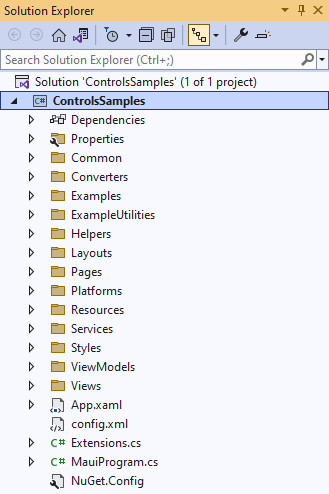
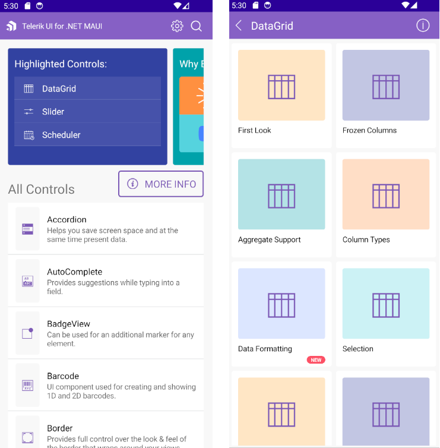
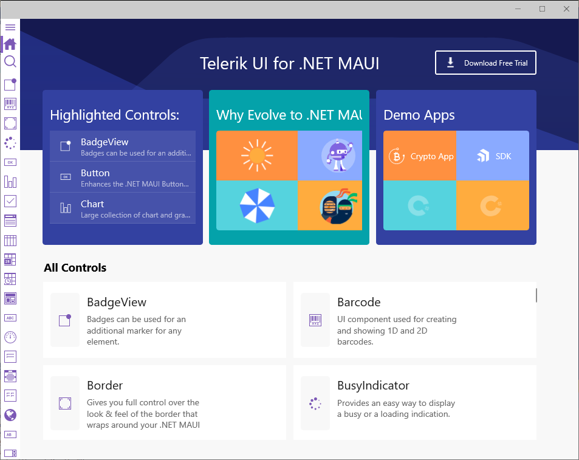
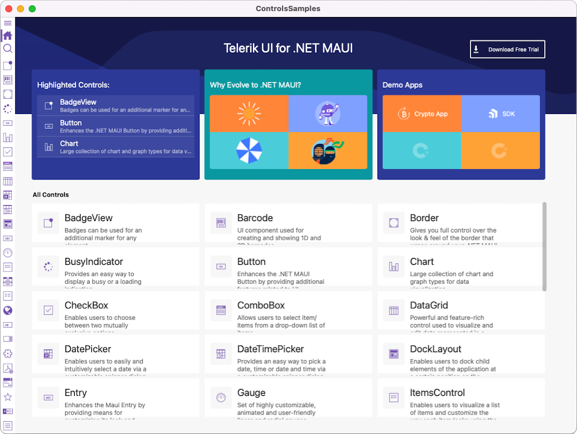
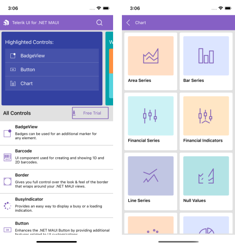

# Controls Samples Application

The **Telerik UI for .NET MAUI Controls Samples** application provides many scenario-specific use cases designed to show off a subset of features for each component.

You can access the Controls Samples application in the following ways:

* If you have already installed Telerik UI for .NET MAUI, navigate to the **/[installation-path]/Telerik UI for .NET MAUI [version]/Examples/ControlsSamples** folder and open the `ControlsSamples.sln` file;
* You can explore the code directly in the [.NET MAUI Samples repository on GitHub](https://github.com/telerik/maui-samples/tree/main/Samples);

>important If you don't have a Telerik UI for .NET MAUI installation, check the [Download Telerik UI for .NET MAUI](#step-2-download-telerik-ui-for-net-maui%}) and [Install Telerik UI for .NET MAUI](#step-3-install-telerik-ui-for-net-maui) help topics where all steps are described. 

## Run ControlsSamples on Windows

1. Open the `ControlsSamples.sln` on Windows with Visual Studio 2022.

  

1. Wait for the project to restore.

1. Select the target framework of the project.

  

1. Select the emulator or device on which you want to run the application.
	
 * ControlsSamples application on Android.

  
	
 * ControlsSamples application on WinUI.

  

## Run ControlsSamples on macOS

>important Review the [macOS Install .NET MAUI GitHub Wiki page](https://github.com/dotnet/maui/wiki/macOS-Install) for more information how to get started on macOS. 

1. Open Terminal inside the ControlsSamples folder.
1. Run on macOS using the following command:

 `dotnet build -t:Run -f net6.0-maccatalyst`
 
	* ControlsSamples application on MacOS.
	
	

1. Run on iOS using the following command:

 `dotnet build -t:Run -f net6.0-ios -p:_DeviceName=:v2:udid=02C556DA-64B8-440B-8F06-F8C56BB7CC22`
 
 where the `-p:_DeviceName=:v2:uuid==02C556DA-64B8-440B-8F06-F8C56BB7CC22` is the desired device id.

	* ControlsSamples application on iOS.

	

