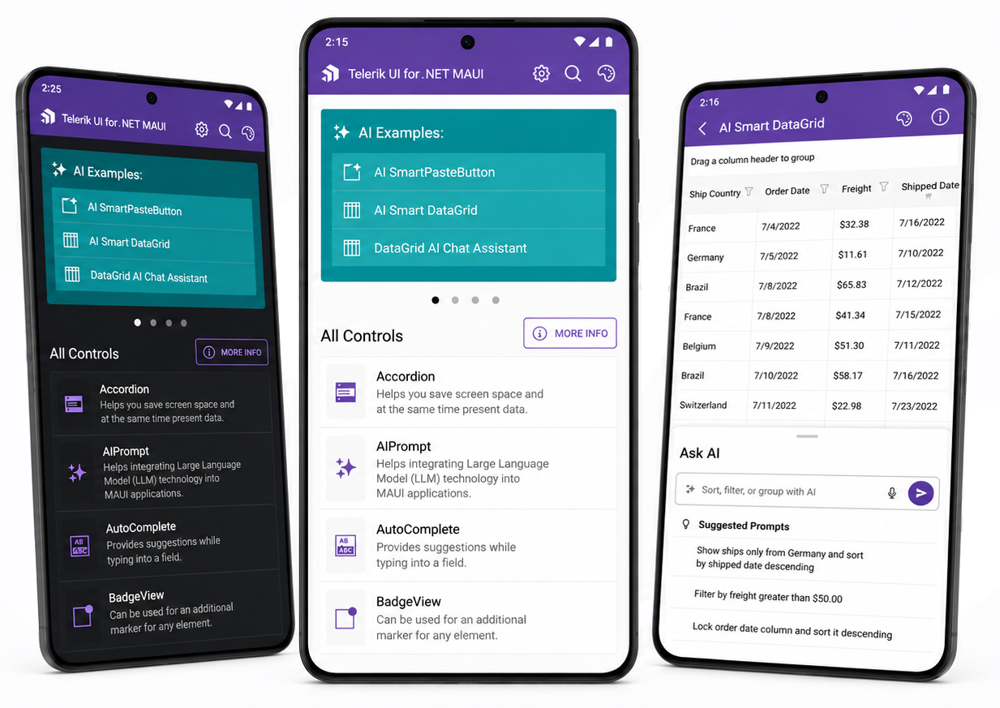
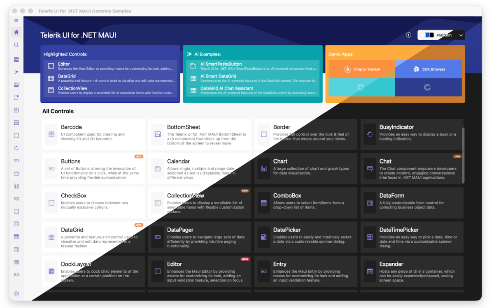

# Controls Samples Application

The Telerik UI for .NET MAUI Controls Samples App provides polished, scenario-based examples for many controls in the Telerik UI for .NET MAUI suite.

This article explains where to get the app, how to open it locally, and how to run it on Windows, Android, macOS, and iOS.

## What You Can Explore in the Controls Samples App

Use the Controls Samples App when you want to:

- Review scenario-based examples for Telerik UI for .NET MAUI controls.
- See how individual controls behave in polished app screens instead of isolated code snippets.
- Compare implementations across Windows, macOS, iOS, and Android.
- Inspect the sample source code before you build similar functionality in your own app.

## Access the Controls Samples App

Use one of the following options to access the app:

1. Install the published app from a store:

   - [Google Play Store for Android devices](https://play.google.com/store/apps/details?id=com.telerik.ControlsSamples&hl=en)
   - [Apple App Store for iPhone](https://apps.apple.com/us/app/telerik-net-maui-controls/id1626276647?platform=iphone)
   - [Microsoft Store for Windows](https://apps.microsoft.com/detail/9n8j3v83pczb?hl=en-us&gl=EN)
   - [Apple App Store for Mac](https://apps.apple.com/us/app/telerik-net-maui-controls/id1626276647)

2. Open the local sample solution from your Telerik UI for .NET MAUI installation:

   ```text
   [installation-path]/Telerik UI for .NET MAUI [version]/Examples/ControlsSamples
   ```

   Open the `ControlsSamples.sln` file.

3. Browse the sample source in the [Telerik .NET MAUI Samples repository on GitHub](https://github.com/telerik/maui-samples/tree/main/Samples) and run it on all platforms.

>important
> If you do not have a Telerik UI for .NET MAUI installation yet, first complete [Download Telerik UI for .NET MAUI](#step-2-download-your-license-key-file) and [Install Telerik UI for .NET MAUI](#step-3-create-a-new-maui-project).

<TabStrip>
<TabStripTab title="Run on Android">

1. On Windows or MacOS open the terminal inside the ControlsSamples folder.

2. Run the following command to build and run the app on Android:

```bash
dotnet build -t:Run -f net10.0-android
```

Here is how the Controls Samples application looks on Android.



</TabStripTab>
<TabStripTab title="Run on iOS">

>important
> Review the [macOS Install .NET MAUI GitHub wiki page](https://github.com/dotnet/maui/wiki/macOS-Install) before you run the sample on macOS.

1. On MacOS open the terminal inside the ControlsSamples folder.

2. Run the following command to build and run the app on iOS:

```bash
dotnet build -t:Run -f net9.0-ios -p:_DeviceName=:v2:udid=02C556DA-64B8-440B-8F06-F8C56BB7CC22
```

In this example, the device ID is `02C556DA-64B8-440B-8F06-F8C56BB7CC22`.

To find the device ID in Xcode:

1. Open Xcode.
2. Select **Window** > **Devices**.
3. Select the connected device.
4. Copy the identifier, or UDID, from **Device Information**.

Here is how the Controls Samples application looks on iOS.


</TabStripTab>
<TabStripTab title="Run on MacCatalyst">

>important
> Review the [macOS Install .NET MAUI GitHub wiki page](https://github.com/dotnet/maui/wiki/macOS-Install) before you run the sample on macOS.

1. On MacOS open the terminal inside the ControlsSamples folder.

2. Run the following command:

```bash
dotnet build -t:Run -f net10.0-maccatalyst
```

Here is how the Controls Samples application looks on MacCatalyst.



</TabStripTab>
<TabStripTab title="Run on Windows">

1. Open `ControlsSamples.sln` in Visual Studio 2022/2026 on Windows.

1. Wait for the project packages to restore.

1. Select the Windows target framework for the project.

   

1. Run the app:

Here is how the Controls Samples application looks on Windows.


</TabStripTab>
</TabStrip>

>tip
> Check the [.NET MAUI Examples and Sample Apps Overview]() for the full list of Telerik UI for .NET MAUI sample applications.

## See Also

- [SDKBrowser App]()
- [Crypto Tracker App]()
- [CRM App]()
