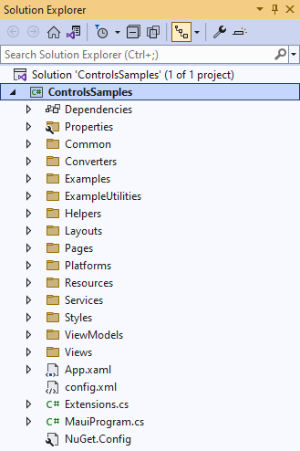
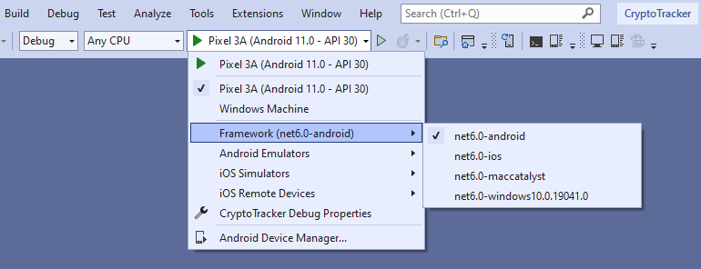
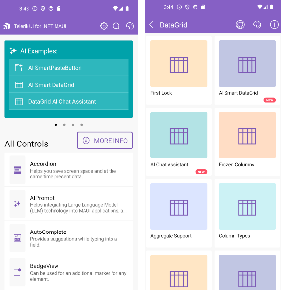
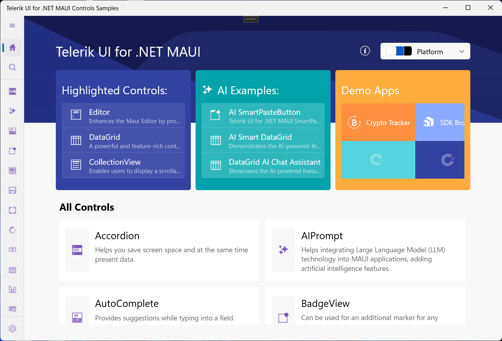
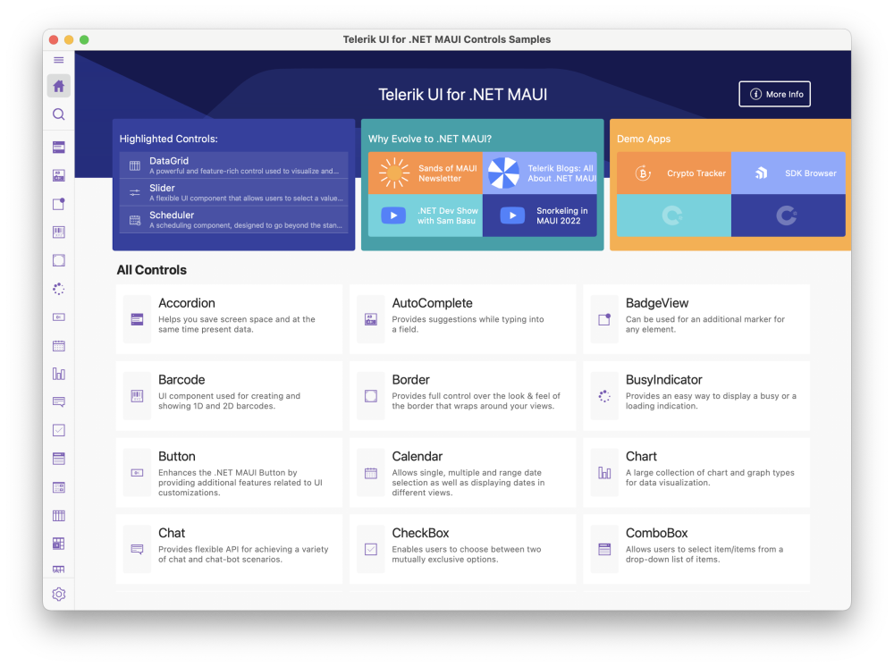
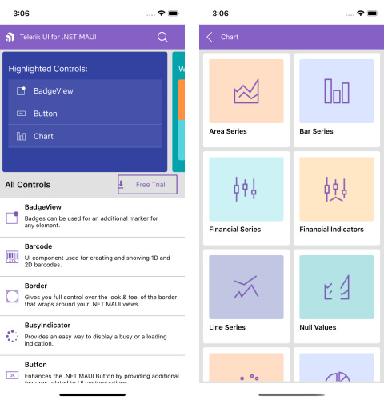

# Controls Samples Application

The Telerik UI for .NET MAUI Controls Samples App helps you explore polished, scenario-based examples for many controls in the Telerik UI for .NET MAUI suite. Use it to review real UI patterns, inspect feature implementations, and compare how Telerik components behave across supported platforms.

This article explains where to get the app, how to open it locally, and how to run it on Windows, Android, macOS, and iOS.

## What You Can Explore in the Controls Samples App

Use the Controls Samples App when you want to:

- Review scenario-based examples for Telerik UI for .NET MAUI controls.
- See how individual controls behave in polished app screens instead of isolated code snippets.
- Compare implementations across Windows, macOS, iOS, and Android.
- Inspect the sample source code before you build similar functionality in your own app.

## Access the Controls Samples App

Use one of the following options to access the app:

1. Install the published app from a store:

   - [Google Play Store for Android devices](https://play.google.com/store/apps/details?id=com.telerik.ControlsSamples&hl=en)
   - [Apple App Store for iPhone](https://apps.apple.com/us/app/telerik-net-maui-controls/id1626276647?platform=iphone)
   - [Microsoft Store for Windows](https://apps.microsoft.com/detail/9n8j3v83pczb?hl=en-us&gl=EN)
   - [Apple App Store for Mac](https://apps.apple.com/us/app/telerik-net-maui-controls/id1626276647)

2. Open the local sample solution from your Telerik UI for .NET MAUI installation:

   ```text
   [installation-path]/Telerik UI for .NET MAUI [version]/Examples/ControlsSamples
   ```

   Open the `ControlsSamples.sln` file.

3. Browse the sample source in the [Telerik .NET MAUI Samples repository on GitHub](https://github.com/telerik/maui-samples/tree/main/Samples).

>important
> If you do not have a Telerik UI for .NET MAUI installation yet, first complete [Download Telerik UI for .NET MAUI](#step-2-download-your-license-key-file) and [Install Telerik UI for .NET MAUI](#step-3-create-a-new-maui-project).

## Before Running the App Locally

Before you run the sample locally, make sure that:

- Telerik UI for .NET MAUI is installed on your machine.
- The required .NET SDK and platform workloads are installed.
- You have Visual Studio 2022 or later (Windows) or Visual Studio Code (macOS or Windows).
- You can access the `ControlsSamples.sln` file or the sample repository source.

## Run ControlsSamples on Windows

Run the Windows version from the local sample solution in Visual Studio 2022:

1. Open `ControlsSamples.sln` in Visual Studio 2022 on Windows.

**Solution structure in Visual Studio**



2. Wait for the project packages to restore.

3. Select the target framework for the project.

**Target framework selection in Visual Studio**



4. Select the emulator, or device on which you want to run the application.

The following screenshots show sample outputs on different Windows development targets:

- **Controls Samples App on Android**

  

- **Controls Samples App on WinUI**

  

## Run ControlsSamples on macOS

>important
> Review the [macOS Install .NET MAUI GitHub wiki page](https://github.com/dotnet/maui/wiki/macOS-Install) before you run the sample on macOS.

1. Open Terminal in the `ControlsSamples` folder.
2. Run the Mac Catalyst target:

```bash
dotnet build -t:Run -f net9.0-maccatalyst
```
 
**Controls Samples App on Mac Catalyst**



## Run ControlsSamples on iOS

1. Open Terminal in the `ControlsSamples` folder.
2. Run the iOS target:

```bash
dotnet build -t:Run -f net9.0-ios
```

This command starts the default simulator. To run the application on a specific device, provide the device ID:

```bash
dotnet build -t:Run -f net9.0-ios -p:_DeviceName=:v2:udid=02C556DA-64B8-440B-8F06-F8C56BB7CC22
```

In this example, the device ID is `02C556DA-64B8-440B-8F06-F8C56BB7CC22`.
 
To find the device ID in Xcode:

1. Open Xcode.
2. Select **Window** > **Devices**.
3. Select the connected device.
4. Copy the identifier, or UDID, from **Device Information**.

**Controls Samples App on iOS**



>tip
> Check the [.NET MAUI Examples and Sample Apps Overview]() for the full list of Telerik UI for .NET MAUI sample applications.

## See Also

- [SDKBrowser App]()
- [Crypto Tracker App]()
