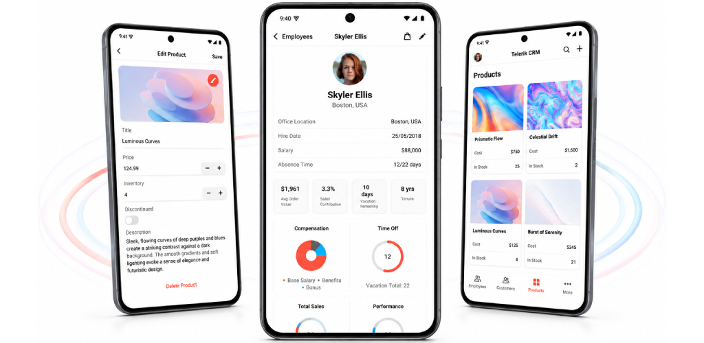
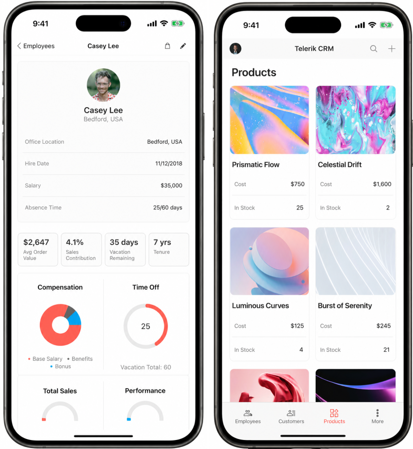
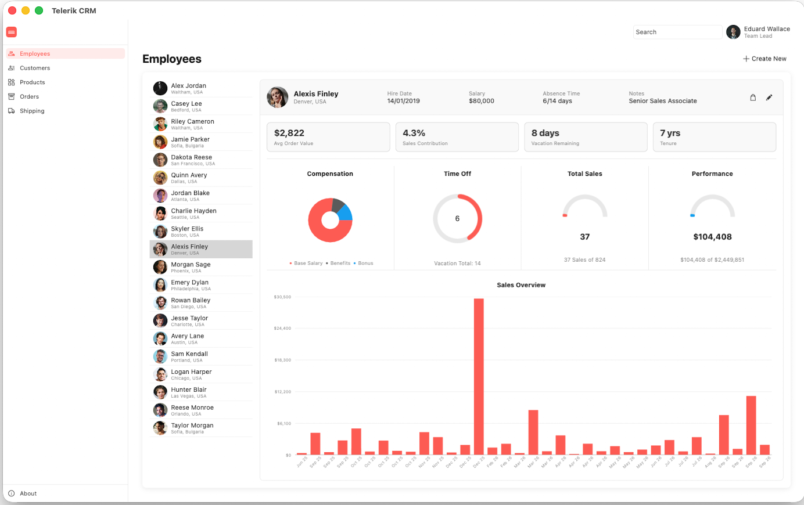

# CRM Application

CRM demo is a real-case CRM application that shows changes in customer relationship management, built with the Telerik UI for .NET MAUI controls. In this demo, you can see in action many of the .NET MAUI controls in the library, including the CollectionView, DataGrid, Charts, and TabView.

## Access the CRM Application

Use one of the following options to access the app:

1. Install the published app from a store:
   - [Google Play Store for Android devices](https://play.google.com/store/apps/details?id=com.telerik.maui.ArtGalleryCRM&hl=en)

2. Browse the sample source in the [Telerik .NET MAUI Samples repository on GitHub](https://github.com/telerik/maui-samples/tree/main/Samples) and run in on all platforms.

<TabStrip>
<TabStripTab title="Run on Android">

1. On Windows or MacOS open the terminal inside the CRM folder.

2. Run the following command to build and run the app on Android:

```bash
dotnet build -t:Run -f net10.0-android
``` 

Here is how the CRM application looks on Android.



</TabStripTab>
<TabStripTab title="Run on iOS">

>important
> Review the [macOS Install .NET MAUI GitHub wiki page](https://github.com/dotnet/maui/wiki/macOS-Install) before you run the sample on macOS.

1. On MacOS open the terminal inside the CRM folder.

2. Run the following command to build and run the app on iOS:

```bash
dotnet build -t:Run -f net9.0-ios -p:_DeviceName=:v2:udid=02C556DA-64B8-440B-8F06-F8C56BB7CC22
```

In this example, the device ID is `02C556DA-64B8-440B-8F06-F8C56BB7CC22`.
 
To find the device ID in Xcode:

1. Open Xcode.
2. Select **Window** > **Devices**.
3. Select the connected device.
4. Copy the identifier, or UDID, from **Device Information**.

Here is how the CRM application looks on iOS.



</TabStripTab>
<TabStripTab title="Run on MacCatalyst">

>important
> Review the [macOS Install .NET MAUI GitHub wiki page](https://github.com/dotnet/maui/wiki/macOS-Install) before you run the sample on macOS.

1. On MacOS open the terminal inside the CRM folder.

2. Run the following command:

```bash
dotnet build -t:Run -f net10.0-maccatalyst
```

Here is how the CRM application looks on MacCatalyst.



</TabStripTab>
<TabStripTab title="Run on Windows">

1. Open `TelerikCRM.sln` in Visual Studio 2022/2026 on Windows.

1. Wait for the project packages to restore.

1. Select the Windows target framework for the project.

1. Run the app.

</TabStripTab>
</TabStrip>

>tip Check the [.NET MAUI Examples Apps]() topic which lists all the sample applications built with Telerik UI for .NET MAUI.

## See Also

- [Controls Samples App]()
- [SDKBrowser App]()
