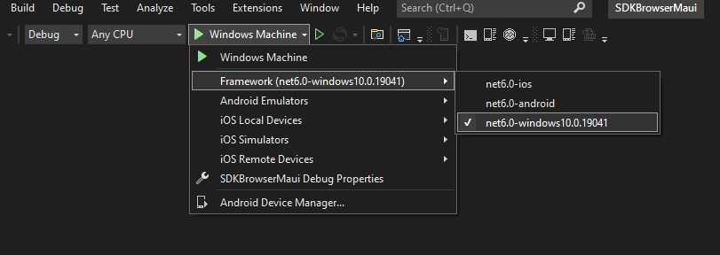

# Crypto Tracker Application

Crypto Tracker demo is a real-case crypto application that shows changes in cryptocurrency prices, built with the Telerik Ui for .NET MAUI controls.

You can start using the Crypto Tracker application in the following ways:

* Explore the CryptoTracek source code directly in the [public GitHub repository]().

* If you have already installed Telerik UI for .NET MAUI, navigate to the **/[installation-path]/Telerik UI for .NET MAUI [version]/Examples/CryptoTracker** folder and open the `CryptoTracker.sln` file;
  The **CryptoTracker** folder is located inside the Examples folder inside the installation folder and you can now use the following subdirectories:

    * **Binaries**&mdash;Contains the needed dlls for Android, iOS, and WinUI.
    * **Examples**&mdash;Contains all examples available (**Sdk app** and **CryptoTracker app**) with the Telerik UI for .NET MAUI controls.
    * **LicenseAgreements**&mdash;Provides the product End-User Licensce Agreement (EULA).
    * **Packages**&mdash;Contains the `Telerik_UI_for_Maui_[version]_Preview.nupkg` file.

>important If you don't have a Telerik UI for .NET MAUI installation, check the [Download Telerik UI for .NET MAUI]({%slug % slug maui-getting-started %}#download-telerik-ui-for-net-maui%}) and [Install Telerik UI for .NET MAUI](#install-telerik-ui-for-net-maui) help topics where all steps are described. 

## Run CryptoTracker on Windows

1. Open the `CryptoTracker.sln` on Windows with Visual Studio 2022 Preview.

1. Wait for the project to restore.

1. Select the target framework of the project.

1. Select the emulator or device on which you want to run the application.
	
* CryptoTracker application on Android.

	
* CryptoTracker application on WinUI.

## Run CryptoTracker on macOS

Open the `CryptoTracker.sln` file by using Visual Studio for Mac.

* CryptoTracker application on iPhone.

* CryptoTracker application on MacOS.

