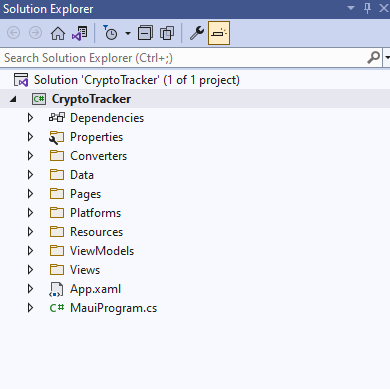
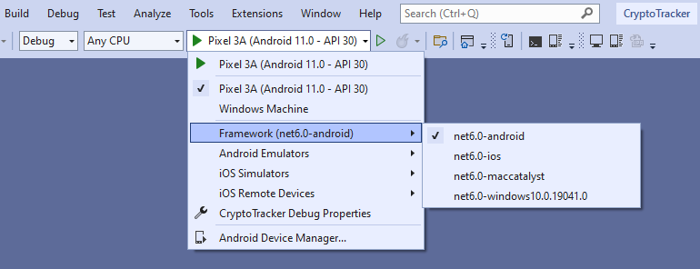
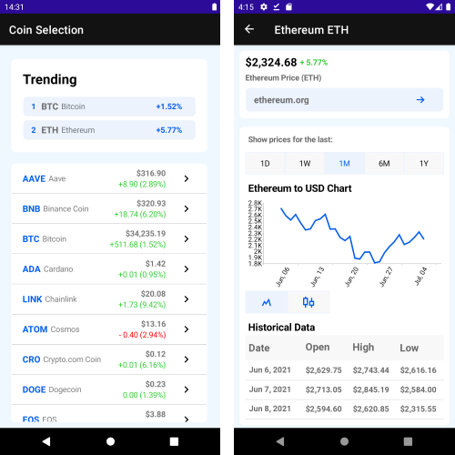
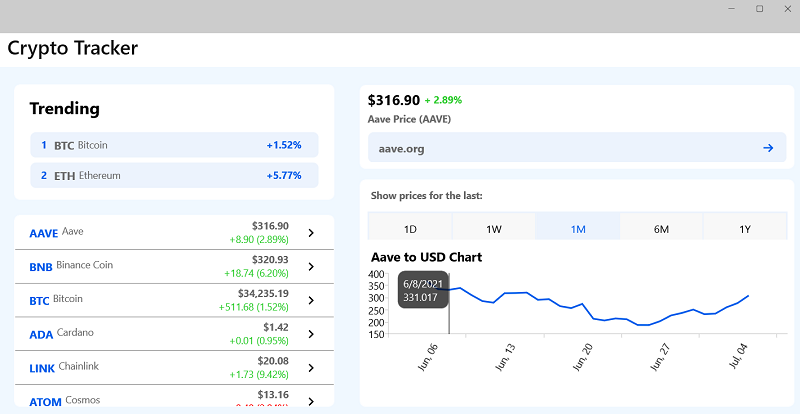
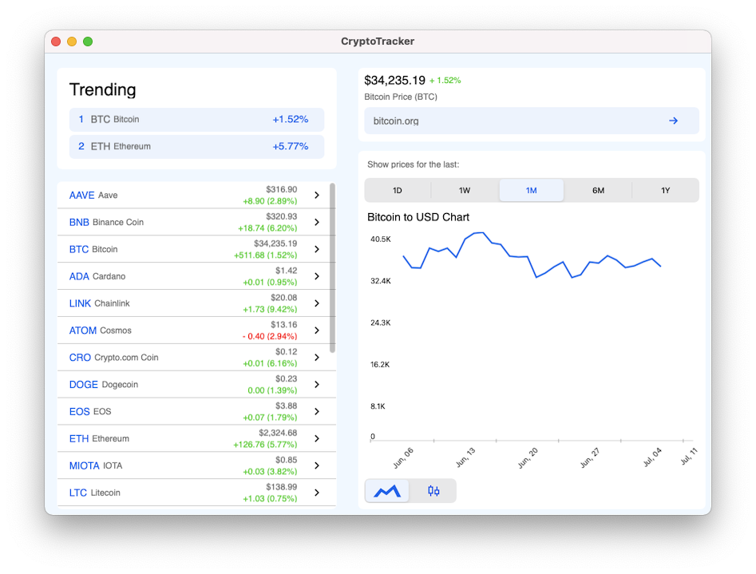

# Crypto Tracker Application

Crypto Tracker demo is a real-case crypto application that shows changes in cryptocurrency prices, built with the Telerik UI for .NET MAUI controls.

You can start using the Crypto Tracker application in the following ways:

You can access the SDKBrowser application in the following ways:

* If you have already installed Telerik UI for .NET MAUI, navigate to the **/[installation-path]/Telerik UI for .NET MAUI [version]/Examples/CryptoTracker** folder and open the `CryptoTracker.sln` file;

* Explore the CryptoTracker code directly in the [MAUI Samples Application repository on GitHub](https://github.com/telerik/maui-samples/tree/main/Samples/CryptoTracker).

>important If you don't have a Telerik UI for .NET MAUI installation, check the [Download Telerik UI for .NET MAUI](#step-2-download-telerik-ui-for-net-maui%}) and [Install Telerik UI for .NET MAUI](#step-3-install-telerik-ui-for-net-maui) help topics where all steps are described. 

## Run CryptoTracker on Windows

**1.** Open the `CryptoTracker.sln` on Windows with Visual Studio 2022.



**2.** Wait for the project to restore.

**3.** Select the target framework of the project.



**4.** Select the emulator or device on which you want to run the application.

* CryptoTracker application on Android.



* CryptoTracker application on WinUI.



## Run CryptoTracker on macOS

>important Review the [macOS Install .NET MAUI GitHub Wiki page](https://github.com/dotnet/maui/wiki/macOS-Install) for more information how to get started on macOS. 

**1.** Open Terminal inside the CryptoTracler folder.

**2.** Run on macOS using the following command:

```SH
dotnet build -t:Run -f net9.0-maccatalyst
```

* CryptoTracker application on MacOS.



**3.** Run on iOS using the following command:

```SH
dotnet build -t:Run -f net9.0-ios
``` 

This command starts a default simulator. To run the application on specific device, you need to provide the device ID. For example: `dotnet build -t:Run -f net9.0-ios -p:_DeviceName=:v2:udid=02C556DA-64B8-440B-8F06-F8C56BB7CC22` where the device ID is `02C556DA-64B8-440B-8F06-F8C56BB7CC22`.
 
 To find the ID: 
  1. Open Xcode.
  2. Click Devices from the Window menu.
  3. Select Connected device.
  4. Under Device Information, you will get an identifier, or UDID, of the device.
  
* CryptoTracker application on iOS.


>tip Check the [.NET MAUI Examples Apps]() topic which lists all the sample applications built with Telerik UI for .NET MAUI.

## See Also

- [Controls Samples App]()
- [SDKBrowser App]()
